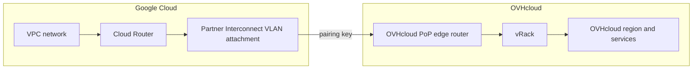

import Api from '@components/Api';
import { Tab, Tabs } from '@rspress/core/theme';

## Objective

OVHcloud Connect Cross Cloud with GCP establishes a private Layer 3 connection between your Google Cloud network and your OVHcloud vRack, over Google Cloud Partner Interconnect. Traffic flows across a dedicated link instead of the public Internet. Unlike connections with other providers, the service key (named **pairing key** in Google Cloud terminology) is generated in the Google Cloud console, then submitted to OVHcloud to provision the connection.

**In this guide, you will learn how to:**

- Create a Partner Interconnect VLAN attachment and generate a pairing key in Google Cloud.
- Order the OVHcloud Connect service for a Google connection.
- Attach your service to a vRack.
- Provide the pairing key to OVHcloud so the connection can be provisioned.
- Verify the resulting circuit, Point-of-Presence (PoP) configuration, and BGP session.

## Requirements

- An OVHcloud vRack
- A Google Cloud project with an existing VPC network and a Cloud Router, in a region reachable from your target OVHcloud PoP
- Access to the <ManagerLink to="/">OVHcloud Control Panel</ManagerLink>
- Access to the [Google Cloud console](https://console.cloud.google.com/)
- If you submit the pairing key with the API: access to the <ApiLink>OVHcloud API</ApiLink>, with credentials created by following the [First Steps with the OVHcloud APIs](/guides/manage-and-operate/api/first-steps) guide

## Introduction

OVHcloud Connect Cross Cloud with GCP is a provider-type OVHcloud Connect connection built on **Google Cloud Partner Interconnect**. On the Google side, the connection is a VLAN attachment on a Cloud Interconnect; on the OVHcloud side, it is delivered as a circuit into your vRack.

Two characteristics set it apart from a standard OVHcloud Connect Provider connection:

- Its service key is a **pairing key** generated in Google Cloud. OVHcloud does not issue or email a service key for a Google connection.
- It is always a **Layer 3 (BGP)** service. Layer 2 is not supported, and the PoP configuration is created automatically when OVHcloud consumes the pairing key — you do not add or remove it manually.

## Instructions

**Contents:**

- [How it works](#how-it-works)
- [Step 1 — Create the VLAN attachment and pairing key in Google Cloud](#step-1)
- [Step 2 — Order OVHcloud Connect for a Google connection](#step-2)
- [Step 3 — Attach a vRack to your service](#step-3)
- [Step 4 — Provide the pairing key to OVHcloud](#step-4)
- [Step 5 — OVHcloud provisions the connection](#step-5)
- [Step 6 — Verify the BGP session and routing](#step-6)
- [Limitations](#limitations)
- [Troubleshooting](#troubleshooting)

### How it works <a name="how-it-works"></a>

Your Google Cloud VPC reaches OVHcloud through a Cloud Router and a Partner Interconnect VLAN attachment. OVHcloud terminates that attachment on a PoP edge router, then delivers the traffic into your vRack and on to your OVHcloud services. BGP runs over the attachment: Google's Cloud Router manages the session on your behalf, and OVHcloud applies its side automatically.



The connection relies on the following fixed parameters:

| Parameter | Value | Notes |
|---|---|---|
| Connection type | Layer 3 (BGP) only | Layer 2 is not supported for a Google connection. |
| Google ASN | `16550` | The standard Google ASN for Partner Interconnect. Google runs the BGP session with this ASN. |
| OVHcloud ASN | `65509` | The ASN OVHcloud presents on the Google attachment. |
| Pairing key format | `{uuid}/{region}/{availabilityDomain}` | Generated by Google. See [Step 1](#step-1). |
| Oversubscription | 1:2 | OVHcloud adheres to Google's 1:2 oversubscription policy on the interconnect. |
| BGP maximum prefixes | `100` | Up to 100 prefixes can be announced per BGP session. |

### Step 1 — Create the VLAN attachment and pairing key in Google Cloud <a name="step-1"></a>

In the [Google Cloud console](https://console.cloud.google.com/), create a **Partner Interconnect VLAN attachment** on your Cloud Router, in the region reachable from your target OVHcloud PoP. Google then generates a **pairing key** for the attachment. Tick the automatic activation option so that you do not have to return to the Google Cloud console once OVHcloud has provisioned the connection.

The pairing key uses the following format:

```text
{uuid}/{region}/{availabilityDomain}
```

For example:

```text
00000000-0000-0000-0000-000000000000/europe-west9/2
```

| Segment | Description | Example |
|---|---|---|
| `uuid` | The pairing key identifier generated by Google. | `00000000-0000-0000-0000-000000000000` |
| `region` | The Google Cloud region of the VLAN attachment. | `europe-west9`, `us-central1` |
| `availabilityDomain` | The Google availability domain index of the attachment. | `2` |

:::warning
Create the VLAN attachment in the region and availability domain that match the OVHcloud PoP you intend to order in [Step 2](#step-2). A mismatch prevents the connection from being provisioned.
:::

### Step 2 — Order OVHcloud Connect for a Google connection <a name="step-2"></a>

From the [OVHcloud Connect product page](/links/network/ovhcloud-connect), order an OVHcloud Connect Provider service and select Google as the provider. Only eligible PoPs appear for selection.

:::info
OVHcloud does not issue any service key for connections with Google Cloud. Instead, the service is activated using the pairing key you generated in the previous step.
:::

### Step 3 — Attach a vRack to your service <a name="step-3"></a>

When your service shows as `active`, attach it to a vRack. Do this before you provide the pairing key: a Google connection cannot be associated with a key until a vRack is attached.

Log in to the <ManagerLink to="/">OVHcloud Control Panel</ManagerLink>, go to the <code className="action">Bare Metal Cloud</code> section and click <code className="action">Network</code>. Open <code className="action">OVHcloud Connect</code> and select your service.

Click the <code className="action">Attach a vRack</code> button and select an existing vRack from the drop-down menu. A message confirms the association.

For more information, refer to the [Installation of OVHcloud Connect Provider from the OVHcloud Control Panel](/guides/network/ovhcloud-connect/occ-provider-control-panel) guide.

:::warning
Detaching the vRack later also removes the Google association key from the service.
:::

### Step 4 — Provide the pairing key to OVHcloud <a name="step-4"></a>

Submit the pairing key so that the virtual circuit towards Google can be deployed. Copy the key exactly as Google issued it, keeping the full `{uuid}/{region}/{availabilityDomain}` string intact.

You can do this with the OVHcloud API, or from the beta version of the OVHcloud Control Panel.

<Tabs>
  <Tab label="OVHcloud API">

<Api version="v1" section="/ovhCloudConnect" method="POST" route={"/ovhCloudConnect/\{serviceName\}/pairingKey"} />

| Parameter | Description |
|---|---|
| `serviceName` | The UUID of your OVHcloud Connect service. |
| `pairingKey` | The pairing key generated in Google Cloud in [Step 1](#step-1). |

The call returns a task.

  </Tab>
  <Tab label="OVHcloud Control Panel (beta)">

The pairing key can only be entered in the beta version of the Control Panel. Open the <ManagerLink to="/beta/#/network/cloud-connect">OVHcloud Control Panel (beta)</ManagerLink> and select your service.

On the <code className="action">Overview</code> tab, click <code className="action">Associate a key</code>, enter your key in the <code className="action">Association key (pairing key)</code> field, then click <code className="action">Associate</code>.

A message confirms that the key has been registered.

:::info
If <code className="action">Associate a key</code> is greyed out, no vRack is attached to the service yet. Complete [Step 3](#step-3) first.
:::

  </Tab>
</Tabs>

### Step 5 — OVHcloud provisions the connection <a name="step-5"></a>

Once OVHcloud receives your pairing key, it provisions the connection automatically:

1. The Google Cloud interconnect attachment is created and paired with your VLAN attachment.
2. The circuit is created on the OVHcloud side.
3. The Layer 3 PoP configuration is applied automatically, using ASN `16550` on the Google side and ASN `65509` on the OVHcloud side.

While provisioning is in progress, the service status is `doing` and the `Circuit` field of your service shows the pairing as in progress. When the circuit is provisioned, the status changes to `active`.

If your service reports that an action is required in the Google Cloud console, activate the VLAN attachment there. This is not needed if you ticked the automatic activation option in [Step 1](#step-1).

#### Review the PoP configuration

For a Google connection, the `PoP configuration` is Layer 3 and is created automatically when your pairing key is consumed. Review it, but do not add or delete it manually. Unlike a standard Provider connection, there is no service key to regenerate or resend.

:::warning
Do not add or delete the PoP configuration of a Google connection manually, from either the Control Panel or the OVHcloud API. The configuration is managed automatically: it is removed when you dissociate the pairing key or cancel the connection — see [Limitations](#limitations).
:::

### Step 6 — Verify the BGP session and routing <a name="step-6"></a>

Google's Cloud Router manages the BGP session (ASN `16550`) with OVHcloud (ASN `65509`). Verify that the session is established and that routes are exchanged on both sides.

| Check | How | Expected result |
|---|---|---|
| Connection status | In the OVHcloud Control Panel, open your OVHcloud Connect solution. | Status is `active`. |
| VLAN attachment | In the Google Cloud console, open the VLAN attachment. | The attachment is up and the BGP session is established. |
| Routes received | Review the routes advertised by OVHcloud on the Google Cloud side. | Your OVHcloud prefixes are visible. |
| Routes advertised | Review the routes your VPC advertises to OVHcloud. | Your Google Cloud prefixes are advertised within the BGP maximum prefixes limit. |
| Connectivity | Ping an OVHcloud resource in the associated vRack from a Google Cloud instance. | The resource replies over the private link. |

For diagnostics from the OVHcloud Control Panel, see [How to initiate a diagnostic for OVHcloud Connect](/guides/network/ovhcloud-connect/occ-diagnostics).

### Limitations <a name="limitations"></a>

| Limitation | Details |
|---|---|
| Layer 3 only | A Google connection supports Layer 3 (BGP) only. Layer 2 is not available. |
| Automatic PoP configuration | Exactly one PoP configuration is created per connection, automatically when the pairing key is consumed. It cannot be added or deleted manually from the Control Panel or the OVHcloud API. |
| Removing the PoP configuration | The PoP configuration is removed when you dissociate the pairing key (<code className="action">Dissociate the key</code> in the beta Control Panel) or when the connection is cancelled. Detaching the vRack also removes the key. The service itself is not terminated and can be associated with Google again. |
| Fixed ASNs | The Google side uses ASN `16550` and the OVHcloud side uses ASN `65509`. These values are set by the provisioning flow and are not customisable. |
| BGP maximum prefixes | Up to `100` prefixes can be announced per BGP session, as for any OVHcloud Connect Layer 3 connection. |
| Oversubscription | The interconnect follows Google's 1:2 oversubscription policy. |

For the full list of technical capabilities and limitations of OVHcloud Connect, see [Technical capabilities and limitations](/guides/network/ovhcloud-connect/occ-limits).

### Troubleshooting <a name="troubleshooting"></a>

| Issue | Possible cause | Solution |
|---|---|---|
| Pairing key rejected | The key does not match the `{uuid}/{region}/{availabilityDomain}` format, or was truncated when copied. | Copy the full pairing key from the Google Cloud console again, keeping all three segments. |
| Connection stuck in `doing` | The VLAN attachment region or availability domain does not match the OVHcloud PoP, or the attachment is not ready on the Google side. | Confirm the region and availability domain of the VLAN attachment, and that the attachment is created and pending pairing in Google Cloud. |
| BGP session not establishing | The attachment is provisioned but routing is not converged yet, or Cloud Router settings are incomplete. | Verify the VLAN attachment and Cloud Router status in Google Cloud. The session uses ASN `16550` (Google) and `65509` (OVHcloud). |
| Some routes not learned | Your network advertises more than the `100` prefixes accepted per BGP session. | Reduce the number of advertised prefixes. If your architecture requires more, contact the support teams. |

## Go further

- [Installation of OVHcloud Connect Provider from the OVHcloud Control Panel](/guides/network/ovhcloud-connect/occ-provider-control-panel)
- [Layer 3 mode](/guides/network/ovhcloud-connect/occ-layer3)
- [Technical capabilities and limitations](/guides/network/ovhcloud-connect/occ-limits)
- [FAQ](/guides/network/ovhcloud-connect/faq)

For training or technical assistance implementing our solutions, contact your sales representative or visit our [Professional Services](/links/professional-services) page to request a quote and have your project analysed by our experts.

Join our [community of users](/links/community).
