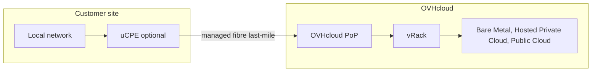

## Objective

OVHcloud Connect Edge extends your private OVHcloud connectivity all the way to a physical site — an office, a store, or a public building — that is not present in an OVHcloud Point-of-Presence (PoP). This guide explains what OVHcloud Connect Edge is, how it connects your site to your OVHcloud services, the single-link and dual-link options, the optional managed device (uCPE), and where the service is available.

This guide is intended for network and IT decision-makers evaluating a turnkey private connection to OVHcloud.

:::warning
OVHcloud Connect Edge is being rolled out. Availability, supported bandwidths, and service levels may change before general availability.
{/* DRAFT: To verify — confirm the current release phase (beta / GA) and update this notice accordingly before publishing. */}
:::

## Overview

OVHcloud Connect Edge provides a fully managed, private connection between a customer site and the OVHcloud services attached to your vRack — such as Bare Metal, Hosted Private Cloud, and Public Cloud resources. It removes the need to reach an OVHcloud PoP yourself.

With OVHcloud Connect Direct or OVHcloud Connect Provider, you are expected to reach an OVHcloud PoP on your own — through colocation, or through a third-party network provider. OVHcloud Connect Edge instead includes the **last-mile access**: OVHcloud arranges and manages the fibre link from your site to its network, then delivers the connection into your vRack.

The result is a single-vendor solution. OVHcloud provides the last-mile access, the connection to your vRack, one service-level agreement (SLA), and one support contact. You do not contract or manage a separate local-loop provider or interconnection provider. Traffic travels over a private, non-Internet path with predictable latency and throughput.

OVHcloud Connect Edge is available in two link topologies:

| Variant | Description | Best for |
|---|---|---|
| **Single link** | One local loop to a single OVHcloud PoP. | Standard connectivity where a single access is sufficient. |
| **Dual link** | Two independent local loops, delivered by two different local-loop operators through two different PoPs. | Resilient connectivity for critical sites that must survive the loss of one access. |

## Key concepts

This section introduces the main building blocks of OVHcloud Connect Edge.

### Managed last-mile access

The last mile is the fibre access between your physical site and the OVHcloud network. With OVHcloud Connect Edge, OVHcloud orders, delivers, and manages this access for you, so you do not deal with a separate telecom operator. The access is delivered directly onto the OVHcloud Connect infrastructure and terminated in your vRack.

### Single link and dual link

A **single link** uses one local loop to one OVHcloud PoP. A **dual link** uses two independent local loops, delivered by two different local-loop operators through two different PoPs, so that the failure of one access does not interrupt connectivity. A dual link requires that your site is eligible with two distinct operators. It improves resilience without guaranteeing fully diverse physical paths: the two local loops may share civil infrastructure or a common optical junction (NRO).

### uCPE (optional managed device)

The uCPE is an optional OVHcloud-managed device installed on your site. It is pre-configured to work with OVHcloud Connect Edge out of the box: once plugged into your network, it establishes the connection to OVHcloud automatically. The uCPE lets you connect a site **without any BGP knowledge**, because OVHcloud manages the routing configuration on the device.

### Layer 3 (BGP) connectivity

OVHcloud Connect Edge is a Layer 3 service: a BGP session is established between the device on your site (the uCPE or your own router) and OVHcloud, over a /30 subnet, using your ASN and the OVHcloud ASN — the same model as OVHcloud Connect Provider. When you use the uCPE, this configuration is handled for you.

## Features and capabilities

This section summarises the bandwidths, service levels, and device capabilities of OVHcloud Connect Edge.

### Bandwidths

OVHcloud Connect Edge offers a range of bandwidths depending on the eligibility of your site.

{/* DRAFT: To verify — confirm the definitive bandwidth tiers before GA. Sources conflict (100 Mbps–1 Gbps in the launch deck; a wider 50 Mbps–10 Gbps range elsewhere). 10 Gbps over FTTO may require manual handling — contact your sales representative. */}

| Bandwidth | Availability |
|---|---|
| 100 Mbps to 1 Gbps | Standard, subject to site eligibility. |
| Higher bandwidths | On request; contact your sales representative. |

### Service levels

OVHcloud Connect Edge commits to an end-to-end availability SLA — from the demarcation point on your site to your vRack — that depends on the connection topology. The guaranteed time to restore (GTR) runs from the moment you open an incident ticket.

{/* DRAFT: To verify — the single-link availability rate (99.5%) is still to be validated by the product and legal teams, and the out-of-business-hours GTR is a planned option not available at launch. Confirm before GA. */}

| Configuration | End-to-end availability SLA (monthly) | Guaranteed time to restore (GTR) |
|---|---|---|
| **Single link** | 99.5% | 4 hours, business hours |
| **Dual link** | 99.9% | 4 hours, business hours |

Business hours are Monday to Friday, 08:00–18:00 (Paris time), excluding French public holidays. A 4-hour GTR outside business hours is planned as an option but is not available at launch.

OVHcloud recommends keeping an alternative means of access to your vRack (for example a VPN) in case of a service disruption.

### uCPE capabilities

The optional uCPE is pre-configured and managed by OVHcloud, and provides:

- An automatic BGP session with OVHcloud Connect Edge.
- LAN routing, with a DHCP client on the LAN port.
- A DHCP server on the LAN port.
- Basic firewall policy (IP and port filtering).
- Static routing.
- Remote configuration, logs, and monitoring.

The uCPE is sold, not rented: you own it once it is paid for. Remote administration requires an Internet access that you provide (it is not part of the service). Each uCPE model supports a maximum bandwidth and cannot be paired with a higher-bandwidth service.

## Availability

OVHcloud Connect Edge is available in the locations below.

{/* DRAFT: To verify — confirm the availability scope and commitment terms at GA. */}

| Item | Value |
|---|---|
| Geography | Metropolitan France |
| Delivery lead time | Up to 12 weeks from order validation (best efforts) |
| Commitment duration | 12, 24, or 36 months |

## Prerequisites and limitations

### Prerequisites

- An OVHcloud account.
- An OVHcloud vRack to which your services are attached.
- A site located in an area eligible for OVHcloud Connect Edge.
- Either the optional uCPE, or your own BGP-capable router on the site.

### Limitations

{/* DRAFT: To verify — the limits below reflect the current rollout phase and will change at GA. Confirm before publishing. */}

| Limitation | Details |
|---|---|
| Geography | Available in metropolitan France. |
| Connection type | Layer 3 (BGP) only. |
| Sites per customer | Limited during the beta phase; the limit increases at general availability. |
| Service levels | SLAs apply at general availability; a beta connection may not carry an official SLA. |

## Use cases

OVHcloud Connect Edge fits several private-connectivity scenarios.

### Hybrid cloud from a non-colocated site

Connect a site that has no presence in a data centre or PoP to your OVHcloud infrastructure, without negotiating with a colocation or telecom provider.

### Private connectivity for multiple offices

Link several offices or branch sites to your OVHcloud services over private connections, managed under a single contract.

### A managed alternative to VPN

Replace an Internet-based VPN with a direct, private link to OVHcloud for higher and more predictable performance.

### Edge and IoT to cloud

Send data from remote equipment, systems, or IoT devices to applications running on your OVHcloud services.

## Go further

- [Getting started with OVHcloud Connect Edge](/guides/network/ovhcloud-connect/occ-edge-getting-started)
- [Concepts overview](/guides/network/ovhcloud-connect/ovhcloud-connect-overview)
- [Installation of OVHcloud Connect Provider from the OVHcloud Control Panel](/guides/network/ovhcloud-connect/occ-provider-control-panel)

For training or technical assistance implementing our solutions, contact your sales representative or visit our [Professional Services](/links/professional-services) page to request a quote and have your project analysed by our experts.

Join our [community of users](/links/community).
