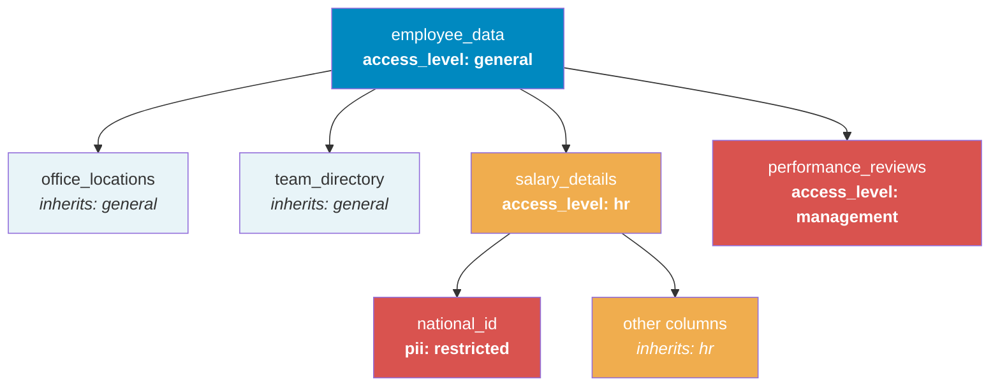

## Objective

This walkthrough demonstrates how to use [policy tags](/guides/public-cloud/data-platform/lakehouse-manager-policy-tags) together with [IAM groups](/guides/public-cloud/data-platform/iam-groups) and [roles](/guides/public-cloud/data-platform/iam-roles-conditions) to manage data access for team members. By assigning a CEL condition to a group's role binding, every user added to the group automatically inherits the correct access level.

## Table of Contents

1.  [Scenario](#scenario)
2.  [Step 1: Design the Tag Schema](#step-1-design-the-tag-schema)
3.  [Step 2: Create and Bind Policy Tags](#step-2-create-and-bind-policy-tags)
4.  [Step 3: Create the IAM Group](#step-3-create-the-iam-group)
5.  [Step 4: Configure the CEL Condition on the Group](#step-4-configure-the-cel-condition-on-the-group)
6.  [Step 5: Add Users to the Group](#step-5-add-users-to-the-group)
7.  [Step 6: Verify Access](#step-6-verify-access)
8.  [Extending the Setup](#extending-the-setup)

## Scenario

Your company has a dataset called **employee_data** containing the following tables:

| Table | Description | Who should access |
|---|---|---|
| `office_locations` | Office addresses, floor plans | Everyone |
| `team_directory` | Employee names, titles, departments | Everyone |
| `salary_details` | Compensation, bonuses, equity | HR only |
| `performance_reviews` | Review scores, manager notes | Management only |

The `salary_details` table has an attribute `national_id` that contains personally identifiable information (PII) and should only be accessible to senior HR staff.

**Goal:** New team members (newcomers) should be able to access `office_locations` and `team_directory`, but **not** `salary_details` or `performance_reviews`. HR staff should access salary data but not see `national_id` unless they are senior HR.

## Step 1: Design the Tag Schema

Create a policy tag key `access_level` with three values:

| Value | Purpose |
|---|---|
| `general` | Baseline access. All employees |
| `hr` | HR-restricted data (salaries, benefits) |
| `management` | Management-restricted data (reviews, notes) |

Additionally, create a tag key `pii` with one value:

| Value | Purpose |
|---|---|
| `restricted` | Personally identifiable information, senior HR only |

## Step 2: Create and Bind Policy Tags

[Create the policy tags](/guides/public-cloud/data-platform/lakehouse-manager-policy-tags#creating-a-new-policy-tag) `access_level` (with values `general`, `hr`, `management`) and `pii` (with value `restricted`).

Then [bind them to data](/guides/public-cloud/data-platform/lakehouse-manager-policy-tags#binding-policy-tags-to-data):

| Resource | Tag |
|---|---|
| **Dataset** `employee_data` | `access_level: general` |
| **Table** `salary_details` | `access_level: hr` |
| **Table** `performance_reviews` | `access_level: management` |
| **Attribute** `salary_details.national_id` | `pii: restricted` |

Tables `office_locations` and `team_directory` have no explicit tags. They inherit `access_level: general` from the dataset.



## Step 3: Create the IAM Group

In the [Identity Access Manager](/guides/public-cloud/data-platform/iam-groups), create three groups:

| Group | Purpose |
|---|---|
| **New Joiners** | New team members, general access only |
| **HR Team** | HR staff, access to salary data (excluding PII) |
| **Senior HR** | Senior HR, full access including PII |

For each group, assign the **ADAC Reader** role (or the appropriate role that includes Advanced Data Access Control read permissions).

:::info
For step-by-step instructions on creating groups and assigning roles, see [Groups](/guides/public-cloud/data-platform/iam-groups).
:::

## Step 4: Configure the CEL Condition on the Group

For each group's ADAC role binding, set the CEL condition in the [IAM](/guides/public-cloud/data-platform/iam-roles-conditions#new-cel-conditions). Remember: conditions must follow the gate chain order, dataset → table → attribute.

**New Joiners**: access to `general` data only:

```text
Service == "adac" && (
  (PolicyTags.access_level == "general" && Resource == "dataset")
  || (PolicyTags.access_level == "general" && Resource == "table")
  || (PolicyTags.access_level == "general" && Resource == "attribute")
)
```

This CEL enforces `access_level: general` at every level. New joiners can access `office_locations` and `team_directory` (which inherit `general` from the dataset) but not `salary_details` (`hr`) or `performance_reviews` (`management`).

**HR Team**: access to `general` + `hr` data, but NOT PII attributes:

```text
Service == "adac" && (
  (PolicyTags.access_level == "general" && Resource == "dataset")
  || (PolicyTags.access_level in ["general", "hr"] && Resource == "table")
  || (PolicyTags.access_level in ["general", "hr"] && !has(PolicyTags.pii) && Resource == "attribute")
)
```

This CEL:

- **Dataset level:** requires `access_level: general`: passes for `employee_data`
- **Table level:** allows `general` or `hr`: passes for all tables except `performance_reviews` (`management`)
- **Attribute level:** allows `general` or `hr` BUT also requires the `pii` tag to **not exist**: denies `national_id` (which has `pii: restricted`)

:::info
The `!has(PolicyTags.pii)` check ensures that any attribute tagged with the `pii` key is denied, regardless of its value. This is useful for blanket PII protection.
:::

**Senior HR**: full access to `general` + `hr` data including PII:

```text
Service == "adac" && (
  (PolicyTags.access_level == "general" && Resource == "dataset")
  || (PolicyTags.access_level in ["general", "hr"] && Resource == "table")
  || (PolicyTags.access_level in ["general", "hr"] && Resource == "attribute")
)
```

This CEL is the same as HR Team but **without** the `!has(PolicyTags.pii)` restriction. Senior HR can access `national_id`.

:::warning
To edit these CEL conditions, navigate to the group's role binding in the IAM and switch to the CEL editor. See [Writing CEL Conditions Manually](/guides/public-cloud/data-platform/lakehouse-manager-policy-tags-cel-conditions#writing-cel-conditions-manually) for instructions.
:::

## Step 5: Add Users to the Group

When a new team member joins:

1. [Create their user account](/guides/public-cloud/data-platform/iam-users) in the IAM.
2. Assign them the required base roles:
   - **Organization Level:** `Organization Viewer`
   - **Project Level:** `AM Admin` (or the appropriate role for their work)
3. [Add them to the **New Joiners** group](/guides/public-cloud/data-platform/iam-groups#assign-users-or-service-accounts-to-a-group).

That's it. The group's CEL condition automatically grants them access to `general`-tagged data. No need to configure individual CEL conditions.

When they move to the HR team:

1. Remove them from **New Joiners**.
2. Add them to **HR Team**.

Their access updates immediately: they can now see `salary_details` (except `national_id`) in addition to the general tables.

## Step 6: Verify Access

Use the [Explorer](/guides/public-cloud/data-platform/lakehouse-manager-explorer) to verify access for a user in each group:

**As a New Joiner:**

| Query | Expected Result |
|---|---|
| `SELECT * FROM office_locations` | Success, inherits `general` |
| `SELECT * FROM team_directory` | Success, inherits `general` |
| `SELECT * FROM salary_details` | Error, table requires `hr` |
| `SELECT * FROM performance_reviews` | Error, table requires `management` |

**As HR Team member:**

| Query | Expected Result |
|---|---|
| `SELECT * FROM office_locations` | Success |
| `SELECT * FROM salary_details` | Error, `SELECT *` includes `national_id` (PII) |
| `SELECT name, salary, bonus FROM salary_details` | Success. No PII columns |
| `SELECT national_id FROM salary_details` | Error, `national_id` has `pii: restricted` |
| `SELECT * FROM performance_reviews` | Error, table requires `management` |

**As Senior HR:**

| Query | Expected Result |
|---|---|
| `SELECT * FROM salary_details` | Success, including `national_id` |
| `SELECT * FROM performance_reviews` | Error, still requires `management` |

## Extending the Setup

### Adding a Management group

To give managers access to `performance_reviews`, create a **Management** group with this CEL:

```text
Service == "adac" && (
  (PolicyTags.access_level == "general" && Resource == "dataset")
  || (PolicyTags.access_level in ["general", "management"] && Resource == "table")
  || (PolicyTags.access_level in ["general", "management"] && Resource == "attribute")
)
```

### Users in multiple groups

A user can belong to multiple groups. If someone is in both **HR Team** and **Management**, they get the union of both groups' permissions. They can access both `salary_details` and `performance_reviews`.

:::info
When a user belongs to multiple groups, each group's role binding is evaluated independently. If **any** role binding's CEL condition passes, the user is granted access. This makes multi-group setups additive.
:::

### Service accounts

[Service accounts](/guides/public-cloud/data-platform/iam-service-accounts) can also be added to groups. If you have a reporting pipeline that needs to read general data, add its service account to the **New Joiners** group rather than configuring individual CEL conditions.

## Go further

If you need training or technical assistance to implement our solutions, contact your sales representative or click on [this link](/links/professional-services) to get a quote and ask our Professional Services experts for a custom analysis of your project.

Ask questions, give your feedback and interact directly with the team building the Data Platform on the dedicated [Discord channel](https://discord.gg/ovhcloud).

If you need support with your OVHcloud services, create a request in our [Help Centre](/links/support-contact).

Join our [community of users](/links/community).
