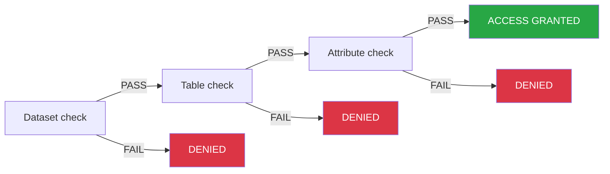

## Objective

Policy tags enable fine-grained data access control by assigning key-value labels to datasets, tables, and attributes. Combined with [CEL conditions](/guides/public-cloud/data-platform/iam-roles-conditions#new-cel-conditions) in the Identity Access Manager, policy tags determine which users can read or write specific data.

## Table of Contents

1.  [Introduction](#introduction)
2.  [How Access Evaluation Works](#how-access-evaluation-works)
3.  [Creating a New Policy Tag](#creating-a-new-policy-tag)
4.  [Policy Tag Configuration](#policy-tag-configuration)
5.  [Binding Policy Tags to Data](#binding-policy-tags-to-data)
6.  [Next Steps](#next-steps)

## Introduction

Policy tags allow you to label datasets, tables, and attributes with key-value pairs that represent access categories (e.g., `sensitivity: high`, `department: finance`). These labels are then referenced in [CEL conditions](/guides/public-cloud/data-platform/iam-roles-conditions#new-cel-conditions) attached to IAM role bindings to control which users can access which data.

A policy tag consists of two parts:

-   **Key**: A unique identifier (e.g., "sensitivity", "department").
-   **Value**: A key can have multiple values (e.g., "high", "medium", "low").

:::warning
**Important**: Assigning a policy tag to a resource does *not* automatically restrict access. You must also configure a [CEL condition](/guides/public-cloud/data-platform/lakehouse-manager-policy-tags-cel-conditions) on the user's IAM role binding that references the tag. Without a CEL condition, the tag has no effect on access control.
:::

## How Access Evaluation Works

When a user attempts to access data, the system evaluates their permissions through a **sequential gate chain**. Understanding this chain is essential for correctly configuring policy tags and CEL conditions.

### The Gate Chain

The system checks the user's [CEL condition](/guides/public-cloud/data-platform/iam-roles-conditions#new-cel-conditions) at three resource levels, **in order**:

1.  **Dataset**: Does the user's CEL condition pass for this dataset?
2.  **Table**: Does the user's CEL condition pass for this table?
3.  **Attribute**: Does the user's CEL condition pass for this attribute?

Each level must pass before the next level is evaluated. If any level fails, access is **denied immediately**: the system does not continue to the next level.

:::warning
**Key insight**: The CEL condition is the **sole enforcement mechanism**. The system does not independently check policy tags. It only evaluates the CEL. If the CEL includes a pass-through for a resource level (e.g., `Resource == "attribute"`), that level's policy tags are **not enforced**. To require a tag at a given level, the CEL must explicitly check it. See [Writing CEL Conditions Manually](/guides/public-cloud/data-platform/lakehouse-manager-policy-tags-cel-conditions#writing-cel-conditions-manually) for details.
:::

:::info
Policy tags at different levels are **cumulative requirements**, not overrides. If a dataset requires tag A and a table within it requires tag B, the user's CEL must check for A at the dataset level AND B at the table level. Tag B does not replace or override tag A.
:::

### Inheritance

If a resource does not have a policy tag explicitly assigned, it inherits the tag from its parent:

-   **Tables**: If a table has no policy tag, it inherits the tag from its parent dataset.
-   **Attributes**: If an attribute has no policy tag, it inherits the tag from its parent table (which may itself have inherited from the dataset).
-   **Datasets**: Datasets are the top of the hierarchy and do not inherit from anything.

Inheritance only flows **downward**. A table's tag is never propagated upward to its parent dataset.

:::info
Inheritance means that tagging a dataset effectively tags all its untagged children. This is the simplest way to set a baseline access level.
:::

### Cumulative Access Requirements

Because each level in the gate chain is evaluated independently, tags at different levels **stack**. The example below uses one tag key, `access_level`, with values `level 1`, `level 2`, and `level 3` applied at the dataset, table, and attribute levels.

**Setup:**

-   **Dataset:** `access_level: level 1`
-   **Table** `chicago_calendar_full`: `access_level: level 2`
-   **Attribute** `bridge` (in `chicago_calendar_full`): `access_level: level 3`

Other tables in the dataset have no explicit tags and inherit `level 1` from the dataset.

| User's tags | Can access dataset? | Can access `chicago_calendar_full`? | Can access `bridge`? |
|---|---|---|---|
| `level 1` only | Yes | No, needs `level 2` too | No |
| `level 1` + `level 2` | Yes | Yes | No, needs `level 3` too |
| `level 1` + `level 2` + `level 3` | Yes | Yes | Yes |
| `level 2` only | No, needs `level 1` for dataset | No | No |
| `level 2` + `level 3` | No, needs `level 1` for dataset | No | No |

:::warning
**Warning**: Tag values (`level 1`, `level 2`, `level 3`) have no inherent hierarchy or ordering in the product. They are labels you define. `level 2` does not automatically include `level 1`. Each value required at a resource level must be explicitly granted to the user.
:::

:::info
**Note**: A user who cannot pass the dataset gate cannot access *anything* in that dataset, regardless of table- or attribute-level tags. Always ensure users have the dataset-level tag as a baseline.
:::

-   **User_A (`level 1` only)**: Can access untagged tables (they inherit `level 1`). Cannot access `chicago_calendar_full`: passes the dataset gate but fails the table gate (`level 2` required). Cannot access `bridge`.
-   **User_B (`level 1` + `level 2`)**: Can access untagged tables and `chicago_calendar_full`. Whether they can read `bridge` depends on their CEL: if the CEL checks tags at the attribute level, `bridge` is denied (`level 3` required). If the CEL uses a pass-through for attributes, `bridge` may still be accessible. See [Common CEL Patterns](/guides/public-cloud/data-platform/lakehouse-manager-policy-tags-cel-conditions#common-cel-patterns).
-   **User_C (`level 1` + `level 2` + `level 3`)**: Has every tag value required in this setup, can access the dataset, `chicago_calendar_full`, and `bridge` when the CEL checks policy tags at each level (attribute pass-throughs are covered in the Important note below).

:::warning
**Important:** Whether attribute-level tags are enforced depends entirely on the CEL condition. To restrict `bridge`, the CEL must explicitly check `PolicyTags.access_level` at `Resource == "attribute"`. A pass-through like `|| Resource == "attribute"` will **skip** the tag check and allow access to all attributes.
:::

:::info
To verify this scenario with SQL in the Explorer, follow [Testing & Troubleshooting](/guides/public-cloud/data-platform/lakehouse-manager-policy-tags-testing).
:::

## Creating a new policy tag

To create a new policy tag, follow these steps:

1.  Click on the **New Policy Tag** button.
2.  Enter the **Key** (e.g., "department"), the first **Value** (e.g., "finance"), and a **Description** for the policy tag.
3.  Save the policy tag and review it in the list of available tags.

## Policy tag configuration

After creating the policy tag, you can configure it by adding more values (e.g., tech, product) or updating its description in the `Tag Informations` section. Policy tags should be configured thoughtfully to match the security needs of the data.

:::info
You can also view the configuration menu for the required policy tag by clicking on the **Edit** button.
:::

The `Associated Data Resources` section details the data resources – tables, datasets, and attributes – to which this policy tag has been applied.

## Binding policy tags to data

Policy tags can be bound to various data components:

### Datasets

1.  Navigate to the **Datasets** section.
2.  Select the dataset you want to apply the policy tag to.
3.  Bind the appropriate policy tag to the dataset by selecting it from the available tags.

### Tables

1.  Navigate to the **Tables** section.
2.  Select the table you want to apply the policy tag to.
3.  Bind the policy tag to the table by following similar steps as for datasets.

### Attributes

1.  Navigate to the **Tables** section and select the desired table.
2.  You can either click on the **POLICY TAGS** section or click on the **EDIT** icon for a specific attribute.
3.  Locate the specific attribute (column) you want to apply the policy tag to or if you chose a specific attribute by clicking on the **EDIT** icon then you directly add the policy tag.
4.  Bind the appropriate policy tag to the attribute. This might involve selecting from a dropdown or using a tagging interface.

## Next Steps

Now that you understand how policy tags work and how to bind them to data, continue with:

- [CEL Conditions & Access Patterns](/guides/public-cloud/data-platform/lakehouse-manager-policy-tags-cel-conditions): Grant Access UI, writing CEL conditions, common patterns
- [Testing & Troubleshooting](/guides/public-cloud/data-platform/lakehouse-manager-policy-tags-testing): Step-by-step access control tests, common errors
- [Example: Team Access with Groups](/guides/public-cloud/data-platform/lakehouse-manager-policy-tags-groups-example): Real-world walkthrough using groups for onboarding

## Go further

If you need training or technical assistance to implement our solutions, contact your sales representative or click on [this link](/links/professional-services) to get a quote and ask our Professional Services experts for a custom analysis of your project.

Ask questions, give your feedback and interact directly with the team building the Data Platform on the dedicated [Discord channel](https://discord.gg/ovhcloud).

If you need support with your OVHcloud services, create a request in our [Help Centre](/links/support-contact).

Join our [community of users](/links/community).
