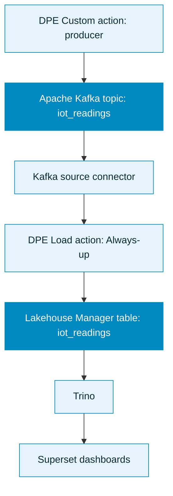
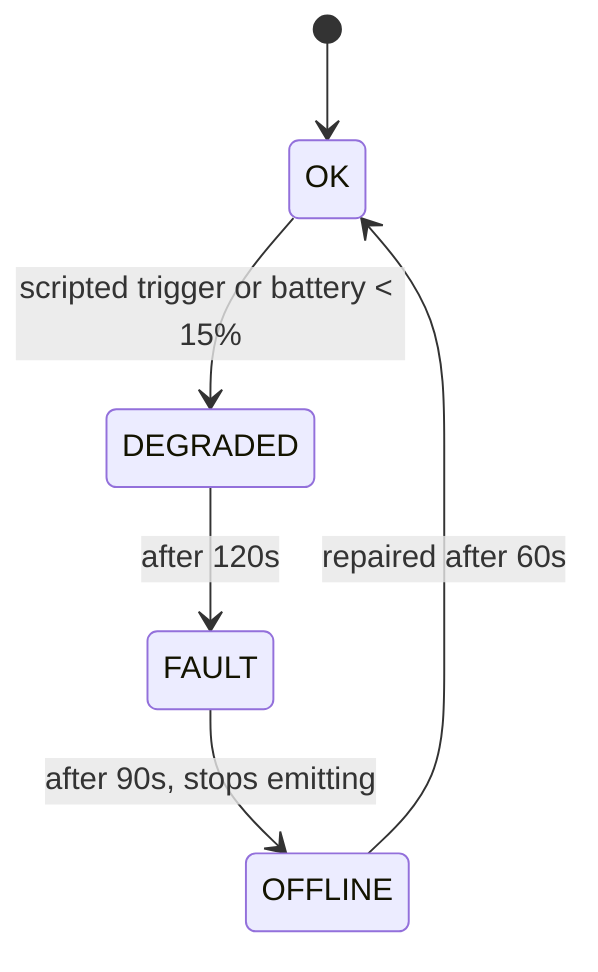

## Objective

This tutorial walks you through a complete, real-time pipeline on the Data Platform: streaming simulated IoT sensor telemetry from a Custom action into Apache Kafka, ingesting it into a Lakehouse Manager table, and visualizing fleet health on a live Superset dashboard.

By the end you will have a working dashboard that shows device health, environmental trends, anomalies, and downtime, driven by a scripted failure scenario so the data is always telling a story.

## Introduction

### Requirements

To follow this tutorial you need:

- An OVHcloud Data Platform project with Data Processing Engine, Lakehouse Manager, and a Superset/Trino setup available.
- An **Apache Kafka** broker you can write to. This tutorial uses an OVH managed Kafka service with client-certificate (mTLS) authentication, but the approach works with any broker once you adapt the connection settings.
- A Kafka topic named `iot_readings` created on your broker (topic auto-creation is often disabled).

We recommend completing the [first Getting Started tutorial](/guides/public-cloud/data-platform/landing-page-getting-started) and the [Stream data from Apache Kafka](/guides/public-cloud/data-platform/tutorials-kafka) tutorial first. This guide assumes you are comfortable with the main components of the platform.

### What you will build



| Stage | Component | Role |
| ----- | --------- | ---- |
| Produce | [Custom action](/guides/public-cloud/data-platform/dpe-actions-custom) | Simulates sensors, emits flat-JSON readings to Kafka every 5 seconds |
| Transport | Apache Kafka | Single topic `iot_readings` |
| Ingest | [Kafka source connector](/guides/public-cloud/data-platform/connectors-sources-kafka) | Streams the topic into a table |
| Store | [Lakehouse Manager table](/guides/public-cloud/data-platform/lakehouse-manager-tables) `iot_readings` | One message becomes one row |
| Load | [Load action](/guides/public-cloud/data-platform/dpe-actions-load) | Consumes the stream into the queryable table |
| Visualize | Superset over [Trino](/guides/public-cloud/data-platform/connectors-consumers-trino) | Live dashboards |

### The scenario

The producer simulates a fleet of environmental sensors (temperature, humidity, CO₂, PM2.5) across four sites in three regions. A per-device state machine drives a realistic failure lifecycle so the data is never flat:



Two devices are scripted to fail on a fixed schedule, so every run reliably shows the full story. Readings follow a compressed ten-minute "daily cycle" with random noise, so trends look believable. When a device goes `OFFLINE` it stops emitting entirely, which shows up later as a genuine gap in the data.

:::info
**About message format.** The Kafka connector reads only root-level JSON fields, and it infers the table schema by sampling messages. Every message therefore emits every field with stable types (numerics are always floats, `error_code` is the string `"NONE"` when healthy). A field that is sometimes missing, or sometimes an integer and sometimes a float, would break the inferred schema.
:::

## Step 1: Store your Kafka credentials in a bucket

Rather than pasting certificates or passwords into the action source, store them in a [Lakehouse Manager bucket](/guides/public-cloud/data-platform/lakehouse-manager-buckets) and pull them at runtime. A Custom action is self-authenticated to its project, so it can read the bucket without any extra credentials, and nothing sensitive lives in your code.

1. In Lakehouse Manager, create a bucket named `iot-demo-certs`.
2. Upload your three mTLS files into it:

| File | Role | Producer setting |
| ---- | ---- | ---------------- |
| `certificate.txt` | CA certificate | `ssl_cafile` |
| `user-certificate.txt` | client certificate | `ssl_certfile` |
| `user-access-key.txt` | client key | `ssl_keyfile` |

The producer downloads these at startup using the [bucket connector](/guides/public-cloud/data-platform/developers-python-sdk-connect-bucket) in the SDK.

:::warning
Never commit certificate or key files to a repository, and never paste them into the action source. Keep them in the bucket only.
:::

## Step 2: Create the producer Custom action

Download the producer and add it as a [Custom action](/guides/public-cloud/data-platform/dpe-actions-custom):

:::info
<a href="/images/public-cloud/data-platform/getting-further/iot-fleet-monitoring/resources/producer.py" download>producer.py</a>
:::

1. Go to **Data Processing Engine > Actions > New > Custom**.
2. Upload the downloaded `producer.py` directly.
3. Set the entry function to `customfunc` in the action's Information panel.
4. Add **`kafka-python`** to the action's Python Requirements.
5. Set the execution mode to [Always-up](/guides/public-cloud/data-platform/dpe-jobs-preferences#always-up). The producer loops continuously, so [Serverless mode](/guides/public-cloud/data-platform/dpe-jobs-preferences#serverless) would time out.

:::warning
Use `kafka-python`, not `kafka`. The bare `kafka` package on PyPI is an abandoned Python-2-only distribution and fails on the workers with `invalid syntax (simple.py, line 54)`. The `kafka-python` package is what provides the `from kafka import ...` namespace.
:::

### Parameters you can adjust

All configuration lives at the top of the file. The ones you are most likely to change:

| Parameter | Default | What it controls |
| --------- | ------- | ---------------- |
| `BOOTSTRAP` | placeholder | Your Kafka broker endpoint, as `host:port`. Required. |
| `KAFKA_MODE` | `"ssl"` | Auth method: `"ssl"` for mTLS, `"sasl_ssl"` for SASL/SCRAM, or `"noauth"`. |
| `TOPIC` | `"iot_readings"` | The Kafka topic to produce to. |
| `MAX_RUNTIME_SECS` | `None` | `None` runs forever (live dashboard). Set a number of seconds for a finite run that exits with SUCCESS instead of a manual "stopped". |
| `CERT_BUCKET` | `"iot-demo-certs"` | The Lakehouse bucket holding your cert files from Step 1. |
| `SITES` and `DEVICES_PER_SITE` | 4 sites, 3 each | Size and shape of the simulated fleet. |
| `METRIC_PROFILE` | temperature, humidity, co2, pm25 | Baseline, daily swing, and noise for each metric. |
| `PHASE_*` durations | 120 / 90 / 60 / 90 s | How long each failure phase lasts. |
| `time.sleep(5)` in the loop | 5 s | Emit interval per device. Lower it for a faster stream. |

### Code highlights

You do not need to read the whole file to run it, but a few parts are worth knowing.

**Connection block.** Set your broker endpoint and auth method here, and choose whether the run is finite:

```python
KAFKA_MODE = "ssl"
TOPIC = "iot_readings"
BOOTSTRAP = "<your-kafka-bootstrap-host>:<port>"
MAX_RUNTIME_SECS = None  # set seconds for a finite, SUCCESS run
```

**Credentials from a bucket.** The certificates are pulled at runtime, never hard-coded, so nothing sensitive lives in the action:

```python
CERT_SOURCE = "bucket"
CERT_BUCKET = "iot-demo-certs"
# resolve_certs() downloads the CA, client cert, and key to /tmp via the SDK
```

**The fleet.** Change the sites or the per-site count to resize the simulation:

```python
SITES = [
    ("paris-dc1",  "EU-W", "indoor-air"),
    ("london-dc2", "EU-W", "indoor-air"),
    # ...
]
DEVICES_PER_SITE = 3   # 4 sites x 3 -> 12 devices
```

**The failure scenario.** Two devices fail on a fixed schedule, and these durations set the pace of the OK to DEGRADED to FAULT to OFFLINE story:

```python
PHASE_DEGRADED, PHASE_FAULT, PHASE_OFFLINE, PHASE_REPAIRED_COOLDOWN = 120, 90, 60, 90
```

Run the action. Every message carries all twelve fields with stable types, so the schema is complete as soon as any data flows. The first scripted device degrades after about fifteen seconds, so `DEGRADED` and `FAULT` samples appear quickly. Watch the action logs for the heartbeat line: `sent ~N messages; fleet: {...}`.

## Step 3: Connect Kafka with the source connector

Go to **Connectors > Sources > Apache Kafka** and create a connection. Point it at your broker endpoint and the `iot_readings` topic.

For an mTLS broker, authenticate with the connector's **SSL fields**: upload your CA certificate, client certificate, and client key, and leave username and password blank.

:::info
The connector form exposes SSL fields even when the broker uses client certificates. Those are what make the mTLS handshake work. For full details see the [Kafka connector reference](/guides/public-cloud/data-platform/connectors-sources-kafka).
:::

## Step 4: Extract metadata and create the table

Once data is flowing, open the [Analyzer](/guides/public-cloud/data-platform/landing-page-connectors-analyzer) and [extract the metadata](/guides/public-cloud/data-platform/connectors-analyzer-extract-metadata).

You will see sixteen attributes: the twelve fields from the producer, plus four envelope columns added by Kafka (`timestamp`, `date`, `offset_r`, `partition`). For a simple append-only table you can skip all four envelope columns. Keep `partition` and `offset_r` only if you want upsert or deduplication semantics.

The producer emits `ts` as an ISO-8601 string. If it is inferred as a string, you can either set it to a Timestamp type in the table, or keep it as a string and parse it in Trino (see [Good to know](#good-to-know)). Build the [Lakehouse Manager table](/guides/public-cloud/data-platform/lakehouse-manager-tables) `iot_readings` from the resulting schema.

The complete column list:

| Attribute | Type | Notes |
| --------- | ---- | ----- |
| `ts` | Timestamp | ISO-8601 UTC event time |
| `device_id` | String | for example `paris-dc1-sensor-01` |
| `site` | String | denormalized dimension |
| `region` | String | `EU-W`, `EU-C`, `EU-E` |
| `device_type` | String | `indoor-air` or `outdoor-air` |
| `temperature` | Number | °C |
| `humidity` | Number | % |
| `co2` | Number | ppm |
| `pm25` | Number | µg/m³ |
| `battery_pct` | Number | declines over device life, drives failure |
| `status` | String | `OK`, `DEGRADED`, `FAULT` (never `OFFLINE`, see below) |
| `error_code` | String | `NONE`, `E_DRIFT`, `E_BATTERY`, `E_STUCK`, `E_SPIKE` |

:::info
`OFFLINE` never appears as a row value. An offline device stops emitting, so downtime shows up as a gap (no rows for that `device_id`). You detect it by comparing each device's latest `ts` against the current time.
:::

## Step 5: Load the stream into your table

Create a [Load action](/guides/public-cloud/data-platform/dpe-actions-load) in Data Processing Engine, mapping the `iot_readings` topic to your `iot_readings` table. Run it in [Always-up mode](/guides/public-cloud/data-platform/dpe-jobs-preferences#always-up) so it keeps consuming the live stream.

:::warning
The Load action keeps running as long as data exists in Kafka, up to its timeout. That is expected for a streaming load.
:::

A Load action that completes normally runs a metadata update automatically, so the table's row count refreshes on its own. In this streaming setup the action runs Always-up and is stopped manually or times out rather than ending cleanly, so that automatic update may not run. When that happens, run an [Update Metadata action](/guides/public-cloud/data-platform/dpe-actions-maintenance#update-metadata) so the row count in Lakehouse Manager reflects the data that was ingested.

## Step 6: Query the table from Superset

Connect Superset to your table through [Trino](/guides/public-cloud/data-platform/connectors-consumers-trino). If you have not deployed Superset yet, follow [Deploy Apache Superset](/guides/public-cloud/data-platform/tutorials-install-apache-superset).

In Superset, add a database connection with a SQLAlchemy URI of the form `trino://<user>@<trino-host>:<port>/<catalog>`. Test the connection before building charts. This is the step where end-to-end setups most often break.

If `ts` arrived as a string, parse it in Trino with `from_iso8601_timestamp(ts)`, which returns a `TIMESTAMP(3) WITH TIME ZONE`. Create a virtual dataset that exposes the parsed column and mark it as the dataset's main temporal column, so it becomes available as the X-axis of time-series charts.

## Step 7: Build the dashboards

The finished dashboard is a single-screen view of the whole fleet.


A practical set of panels:

| Panel | Chart type | What it shows |
| ----- | ---------- | ------------- |
| KPI row | Big Number | Devices online, fleet size, devices in alert, average CO₂ now |
| Fleet health | Donut | Live status split across the fleet |
| Battery levels | Bar | Per-device battery, lowest first, for predictive maintenance |
| Readings trend | Line (time-series) | CO₂, temperature, PM2.5 over time, per site |
| Readings by site | Bar | Average CO₂ and PM2.5 compared across sites |
| Error-code breakdown | Bar | Which fault types are occurring |
| Downtime table | Table | Devices whose latest reading is stale, highlighted |

For the full virtual datasets and the exact Trino SQL and configuration of every panel, follow the companion page:

[Build the Superset dashboards](/guides/public-cloud/data-platform/tutorials-iot-fleet-monitoring-superset-dashboards)

A few Superset tips that save time:

- On **bar charts**, put the category in the X-axis and leave the Dimensions box empty. Dimensions is only for splitting each bar into sub-series.
- Threshold lines, such as a battery warning level, are available on time-series charts through annotation layers. On a categorical bar chart, sort ascending instead. On a table, use conditional formatting.
- CO₂ values (around 480) dwarf temperature (around 21) and PM2.5 (around 9) on a shared axis. Chart CO₂ separately, or use a secondary axis, so the small metrics stay readable.
- The downtime table is empty when the fleet is healthy, which is correct. Build it without a filter so it lists every device, then highlight stale rows with conditional formatting, so the panel never looks broken.

## Good to know

- **The producer never ends by design.** It is an infinite loop in Always-up mode. The action's default timeout is around two hours. If you stop it manually it shows as "stopped" rather than a success, because there is no natural end. To get a clean success run, set `MAX_RUNTIME_SECS` to a number of seconds. The loop then flushes, closes, logs a total, and exits. Leave it as `None` for a continuously live dashboard.
- **Refresh the row count with Update Metadata.** A Load action that ends normally updates the table metadata automatically. In this streaming setup the action runs Always-up and is stopped or times out instead of ending cleanly, so as noted in Step 5 you may need to run an Update Metadata action for the row count to reflect what was ingested.
- **Parse `ts` for time-series.** If the column is a string, parse it with `from_iso8601_timestamp(ts)` and mark it as the temporal column in Superset.
- **Guard against unparseable rows.** If a test message left a row whose `ts` is not a valid timestamp, `from_iso8601_timestamp` throws `INVALID_FUNCTION_ARGUMENT`. Wrap the parse in `try(from_iso8601_timestamp(ts))` so the bad row resolves to null, or delete the row.

## What you have built

You now have a full streaming pipeline: a Custom action producing simulated telemetry, Kafka transporting it, a connector and Load action ingesting it into Lakehouse Manager, and Superset visualizing it live over Trino. As the scripted failures play out, the dashboard moves through the whole story: a healthy fleet, a device degrading and faulting, a window of downtime that surfaces in the downtime table and as a gap in the trend, and finally a repair that returns the device to normal.

From here you can extend the model with a separate device dimension table, add more metrics, or adapt the producer to replay your own real sensor data.

:::info
**This pattern scales.** The same building blocks compose into a much larger pipeline. Because one topic maps to one table, you handle multiple data streams by repeating the pieces: add more Kafka topics, extract metadata for each into its own Lakehouse Manager table, and run one Load action per topic-to-table mapping. A single producer can emit to several topics, and Superset can join across the resulting tables through Trino. So a multi-topic, multi-table fleet (for example, separate streams for environmental readings, energy usage, and device events) is just this tutorial applied several times over, feeding one set of dashboards.
:::

## Go further

If you need training or technical assistance to implement our solutions, contact your sales representative or click on [this link](/links/professional-services) to get a quote and ask our Professional Services experts for a custom analysis of your project.

Ask questions, give your feedback and interact directly with the team building the Data Platform on the dedicated [Discord channel](https://discord.gg/ovhcloud).

If you need support with your OVHcloud services, create a request in our [Help Centre](/links/support-contact).

Join our [community of users](/links/community).
