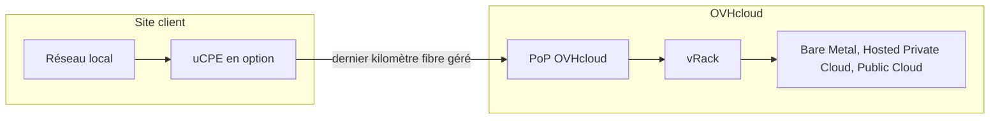

## Objectif

OVHcloud Connect Edge étend votre connectivité privée OVHcloud jusqu'à un site physique — un bureau, un magasin ou un bâtiment public — qui n'est pas présent dans un point de présence (PoP) OVHcloud. Ce guide explique ce qu'est OVHcloud Connect Edge, comment il connecte votre site à vos services OVHcloud, les options de lien simple et de lien double, le boîtier géré en option (uCPE), ainsi que les zones où le service est disponible.

Ce guide s'adresse aux décideurs réseau et informatiques qui évaluent une connexion privée clé en main vers OVHcloud.

:::warning
OVHcloud Connect Edge est en cours de déploiement. La disponibilité, les débits pris en charge et les niveaux de service peuvent évoluer avant la disponibilité générale.
{/* DRAFT: To verify — confirm the current release phase (beta / GA) and update this notice accordingly before publishing. */}
:::

## Présentation

OVHcloud Connect Edge fournit une connexion privée entièrement gérée entre un site client et les services OVHcloud rattachés à votre vRack — Bare Metal, Hosted Private Cloud et ressources Public Cloud. Il supprime la nécessité d'atteindre vous-même un PoP OVHcloud.

Avec OVHcloud Connect Direct ou OVHcloud Connect Provider, vous êtes censé atteindre un PoP OVHcloud par vos propres moyens, via une colocation ou via un opérateur réseau tiers. OVHcloud Connect Edge inclut au contraire l'accès de dernier kilomètre : OVHcloud commande et gère le lien fibre depuis votre site jusqu'à son réseau, puis délivre la connexion dans votre vRack.

Il en résulte une solution à fournisseur unique. OVHcloud fournit l'accès de dernier kilomètre, la connexion à votre vRack, un seul niveau de service (SLA) et un seul interlocuteur de support. Vous ne contractez ni ne gérez de fournisseur de boucle locale ou d'interconnexion distinct. Le trafic emprunte un chemin privé, hors Internet, avec une latence et un débit prévisibles.

OVHcloud Connect Edge est disponible selon deux topologies de lien :

| Variante | Description | Recommandée pour |
|---|---|---|
| **Lien simple** | Une boucle locale vers un seul PoP OVHcloud. | Une connectivité standard, lorsqu'un seul accès suffit. |
| **Lien double** | Deux boucles locales indépendantes, délivrées par deux opérateurs de boucle locale différents via deux PoP différents. | Une connectivité résiliente pour les sites critiques qui doivent survivre à la perte d'un accès. |

## Concepts clés

Cette section présente les principaux composants d'OVHcloud Connect Edge.

### Accès de dernier kilomètre géré

Le dernier kilomètre est l'accès fibre entre votre site physique et le réseau OVHcloud. Avec OVHcloud Connect Edge, OVHcloud commande, livre et gère cet accès pour vous : vous n'avez pas affaire à un opérateur télécom distinct. L'accès est délivré directement sur l'infrastructure OVHcloud Connect et terminé dans votre vRack.

### Lien simple et lien double

Un lien simple utilise une seule boucle locale vers un PoP OVHcloud. Un lien double utilise deux boucles locales indépendantes, délivrées par deux opérateurs de boucle locale différents via deux PoP différents, de sorte que la panne d'un accès n'interrompt pas la connectivité. Un lien double nécessite que votre site soit éligible auprès de deux opérateurs distincts. Il améliore la résilience sans garantir une diversité physique intégrale des chemins : les deux boucles locales peuvent emprunter des infrastructures de génie civil communes ou un même nœud de raccordement optique (NRO).

### uCPE (boîtier géré en option)

Le uCPE est un boîtier géré par OVHcloud, installé en option sur votre site. Il est préconfiguré pour fonctionner immédiatement avec OVHcloud Connect Edge : une fois raccordé à votre réseau, il établit automatiquement la connexion vers OVHcloud. Le uCPE vous permet de raccorder un site sans aucune connaissance de BGP, car OVHcloud gère la configuration du routage sur le boîtier.

### Connectivité de niveau 3 (BGP)

OVHcloud Connect Edge est un service de niveau 3 : une session BGP est établie entre le boîtier de votre site (le uCPE ou votre propre routeur) et OVHcloud, sur un sous-réseau /30, à l'aide de votre ASN et de l'ASN OVHcloud — le même modèle qu'OVHcloud Connect Provider. Lorsque vous utilisez le uCPE, cette configuration est réalisée pour vous.

## Fonctionnalités et capacités

Cette section résume les débits, les niveaux de service et les capacités du boîtier d'OVHcloud Connect Edge.

### Débits

OVHcloud Connect Edge propose une gamme de débits selon l'éligibilité de votre site.

{/* DRAFT: To verify — confirm the definitive bandwidth tiers before GA. Sources conflict (100 Mbps–1 Gbps in the launch deck; a wider 50 Mbps–10 Gbps range elsewhere). 10 Gbps over FTTO may require manual handling — contact your sales representative. */}

| Débit | Disponibilité |
|---|---|
| De 100 Mbps à 1 Gbps | Standard, selon l'éligibilité du site. |
| Débits supérieurs | Sur demande ; contactez votre commercial. |

### Niveaux de service

OVHcloud Connect Edge s'engage sur un taux de disponibilité de bout en bout — du point de démarcation sur votre site jusqu'à votre vRack — qui dépend de la topologie de la connexion. La garantie de temps de rétablissement (GTR) court à compter de l'ouverture d'un ticket d'incident.

{/* DRAFT: To verify — the single-link availability rate (99.5%) is still to be validated by the product and legal teams, and the out-of-business-hours GTR is a planned option not available at launch. Confirm before GA. */}

| Configuration | Taux de disponibilité de bout en bout (mensuel) | Garantie de temps de rétablissement (GTR) |
|---|---|---|
| **Lien simple** | 99,5 % | 4 heures, heures ouvrées |
| **Lien double** | 99,9 % | 4 heures, heures ouvrées |

Les heures ouvrées s'entendent du lundi au vendredi, de 8h00 à 18h00 (heure de Paris), hors jours fériés légaux en France métropolitaine. Une GTR de 4 heures hors heures ouvrées est prévue en option, mais n'est pas disponible au lancement.

OVHcloud recommande de conserver un moyen d'accès alternatif à votre vRack (par exemple un VPN) en cas d'interruption du service.

### Capacités du uCPE

Le uCPE en option est préconfiguré et géré par OVHcloud. Il fournit :

- Une session BGP automatique avec OVHcloud Connect Edge.
- Le routage LAN, avec un client DHCP sur le port LAN.
- Un serveur DHCP sur le port LAN.
- Une politique de pare-feu basique (filtrage IP et ports).
- Le routage statique.
- La configuration à distance, les logs et la supervision.

Le uCPE est vendu, et non loué : vous en devenez propriétaire une fois le prix payé. Son administration à distance nécessite un accès à Internet que vous fournissez (il n'est pas compris dans le service). Chaque modèle de uCPE prend en charge un débit maximal et ne peut pas être associé à un service de débit supérieur.

## Disponibilité

OVHcloud Connect Edge est disponible dans les zones ci-dessous.

{/* DRAFT: To verify — confirm the availability scope and commitment terms at GA. */}

| Élément | Valeur |
|---|---|
| Géographie | France métropolitaine |
| Délai de livraison | Jusqu'à 12 semaines à compter de la validation de la commande (meilleurs efforts) |
| Durée d'engagement | 12, 24 ou 36 mois |

## Prérequis et limitations

### Prérequis

- Un compte OVHcloud.
- Un vRack OVHcloud auquel vos services sont rattachés.
- Un site situé dans une zone éligible à OVHcloud Connect Edge.
- Soit le uCPE en option, soit votre propre routeur compatible BGP sur le site.

### Limitations

{/* DRAFT: To verify — the limits below reflect the current rollout phase and will change at GA. Confirm before publishing. */}

| Limitation | Détails |
|---|---|
| Géographie | Disponible en France métropolitaine. |
| Type de connexion | Niveau 3 (BGP) uniquement. |
| Sites par client | Limité pendant la phase bêta ; la limite augmente à la disponibilité générale. |
| Niveaux de service | Les SLA s'appliquent à la disponibilité générale ; une connexion en bêta peut ne pas bénéficier d'un SLA officiel. |

## Cas d'usage

OVHcloud Connect Edge répond à plusieurs scénarios de connectivité privée.

### Cloud hybride depuis un site non colocalisé

Raccordez à votre infrastructure OVHcloud un site sans présence en centre de données ni en PoP, sans négocier avec un fournisseur de colocation ou un opérateur télécom.

### Connectivité privée pour plusieurs sites

Reliez plusieurs bureaux ou sites distants à vos services OVHcloud via des connexions privées, gérées sous un contrat unique.

### Une alternative gérée au VPN

Remplacez un VPN sur Internet par un lien direct et privé vers OVHcloud, pour des performances plus élevées et plus prévisibles.

### Edge et IoT vers le cloud

Envoyez les données d'équipements, de systèmes ou d'objets connectés distants vers les applications hébergées sur vos services OVHcloud.

## Aller plus loin

- [Débuter avec OVHcloud Connect Edge](/guides/network/ovhcloud-connect/occ-edge-getting-started)
- [Présentation des concepts](/guides/network/ovhcloud-connect/ovhcloud-connect-overview)
- [Mise en service de OVHcloud Connect Provider depuis l'espace client OVHcloud](/guides/network/ovhcloud-connect/occ-provider-control-panel)

Pour toute formation ou assistance technique à la mise en œuvre de nos solutions, contactez votre commercial ou rendez-vous sur notre page [Professional Services](/links/professional-services) pour demander un devis et faire analyser votre projet par nos experts.

Échangez avec notre [communauté d'utilisateurs](/links/community).
