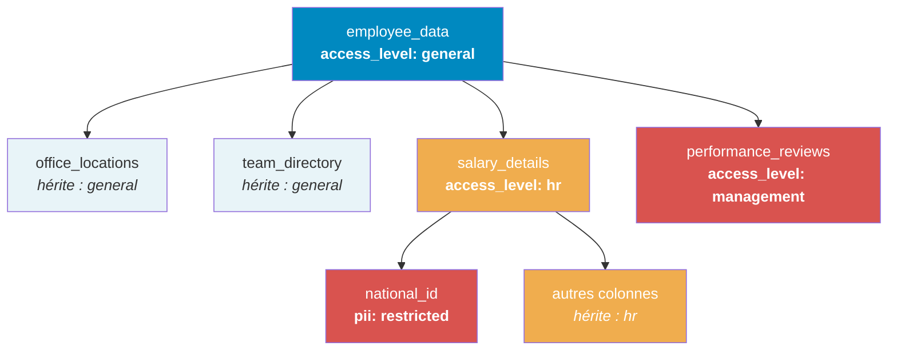

## Objectif

Ce tutoriel montre comment utiliser les [policy tags](/guides/public-cloud/data-platform/lakehouse-manager-policy-tags) avec les [groupes IAM](/guides/public-cloud/data-platform/iam-groups) et les [rôles](/guides/public-cloud/data-platform/iam-roles-conditions) pour gérer l'accès aux données des membres d'une équipe. En assignant une condition CEL à l'association de rôle d'un groupe, chaque utilisateur ajouté au groupe hérite automatiquement du bon niveau d'accès.

## Sommaire

1.  [Scénario](#scénario)
2.  [Étape 1 : Concevoir le schéma de tags](#étape-1--concevoir-le-schéma-de-tags)
3.  [Étape 2 : Créer et associer les policy tags](#étape-2--créer-et-associer-les-policy-tags)
4.  [Étape 3 : Créer le groupe IAM](#étape-3--créer-le-groupe-iam)
5.  [Étape 4 : Configurer la condition CEL sur le groupe](#étape-4--configurer-la-condition-cel-sur-le-groupe)
6.  [Étape 5 : Ajouter des utilisateurs au groupe](#étape-5--ajouter-des-utilisateurs-au-groupe)
7.  [Étape 6 : Vérifier l'accès](#étape-6--vérifier-laccès)
8.  [Étendre la configuration](#étendre-la-configuration)

## Scénario

Votre entreprise possède un dataset appelé **employee_data** contenant les tables suivantes :

| Table | Description | Qui doit y accéder |
|---|---|---|
| `office_locations` | Adresses des bureaux, plans d'étage | Tout le monde |
| `team_directory` | Noms des employés, titres, services | Tout le monde |
| `salary_details` | Rémunération, primes, actions | RH uniquement |
| `performance_reviews` | Scores d'évaluation, notes des managers | Management uniquement |

La table `salary_details` possède un attribut `national_id` contenant des informations personnelles identifiables (PII) qui ne doivent être accessibles qu'au personnel RH senior.

**Objectif :** Les nouveaux membres de l'équipe (newcomers) doivent pouvoir accéder à `office_locations` et `team_directory`, mais **pas** à `salary_details` ni à `performance_reviews`. Le personnel RH doit accéder aux données salariales sans voir `national_id`, sauf s'il s'agit de RH senior.

## Étape 1 : Concevoir le schéma de tags

Créez une clé de policy tag `access_level` avec trois valeurs :

| Valeur | Objectif |
|---|---|
| `general` | Accès de base. Tous les employés |
| `hr` | Données restreintes RH (salaires, avantages) |
| `management` | Données restreintes management (évaluations, notes) |

De plus, créez une clé de tag `pii` avec une valeur :

| Valeur | Objectif |
|---|---|
| `restricted` | Informations personnelles identifiables, RH senior uniquement |

## Étape 2 : Créer et associer les policy tags

[Créez les policy tags](/guides/public-cloud/data-platform/lakehouse-manager-policy-tags#créer-un-nouveau-policy-tag) `access_level` (avec les valeurs `general`, `hr`, `management`) et `pii` (avec la valeur `restricted`).

Puis [associez-les aux données](/guides/public-cloud/data-platform/lakehouse-manager-policy-tags#associer-des-policy-tags-aux-données) :

| Ressource | Tag |
|---|---|
| **Dataset** `employee_data` | `access_level: general` |
| **Table** `salary_details` | `access_level: hr` |
| **Table** `performance_reviews` | `access_level: management` |
| **Attribute** `salary_details.national_id` | `pii: restricted` |

Les tables `office_locations` et `team_directory` n'ont aucun tag explicite. Elles héritent de `access_level: general` depuis le dataset.



## Étape 3 : Créer le groupe IAM

Dans l'[Identity Access Manager](/guides/public-cloud/data-platform/iam-groups), créez trois groupes :

| Groupe | Objectif |
|---|---|
| **New Joiners** | Nouveaux membres de l'équipe, accès général uniquement |
| **HR Team** | Personnel RH, accès aux données salariales (hors PII) |
| **Senior HR** | RH senior, accès complet incluant les PII |

Pour chaque groupe, assignez le rôle **ADAC Reader** (ou le rôle approprié incluant les permissions de lecture de l'Advanced Data Access Control).

:::info
Pour des instructions étape par étape sur la création de groupes et l'assignation de rôles, consultez [Groups](/guides/public-cloud/data-platform/iam-groups).
:::

## Étape 4 : Configurer la condition CEL sur le groupe

Pour l'association de rôle ADAC de chaque groupe, définissez la condition CEL dans l'[IAM](/guides/public-cloud/data-platform/iam-roles-conditions#nouvelles-conditions-cel). Rappel : les conditions doivent suivre l'ordre de la chaîne de contrôles, dataset → table → attribute.

**New Joiners** : accès aux données `general` uniquement :

```text
Service == "adac" && (
  (PolicyTags.access_level == "general" && Resource == "dataset")
  || (PolicyTags.access_level == "general" && Resource == "table")
  || (PolicyTags.access_level == "general" && Resource == "attribute")
)
```

Cette CEL applique `access_level: general` à chaque niveau. Les New Joiners peuvent accéder à `office_locations` et `team_directory` (qui héritent de `general` depuis le dataset) mais pas à `salary_details` (`hr`) ni à `performance_reviews` (`management`).

**HR Team** : accès aux données `general` + `hr`, mais PAS aux attributs PII :

```text
Service == "adac" && (
  (PolicyTags.access_level == "general" && Resource == "dataset")
  || (PolicyTags.access_level in ["general", "hr"] && Resource == "table")
  || (PolicyTags.access_level in ["general", "hr"] && !has(PolicyTags.pii) && Resource == "attribute")
)
```

Cette CEL :

- **Niveau dataset :** exige `access_level: general` : passe pour `employee_data`
- **Niveau table :** autorise `general` ou `hr` : passe pour toutes les tables sauf `performance_reviews` (`management`)
- **Niveau attribute :** autorise `general` ou `hr` MAIS exige aussi que le tag `pii` **n'existe pas** : refuse `national_id` (qui possède `pii: restricted`)

:::info
La vérification `!has(PolicyTags.pii)` garantit que tout attribut tagué avec la clé `pii` est refusé, quelle que soit sa valeur. Ceci est utile pour une protection PII générale.
:::

**Senior HR** : accès complet aux données `general` + `hr` incluant les PII :

```text
Service == "adac" && (
  (PolicyTags.access_level == "general" && Resource == "dataset")
  || (PolicyTags.access_level in ["general", "hr"] && Resource == "table")
  || (PolicyTags.access_level in ["general", "hr"] && Resource == "attribute")
)
```

Cette CEL est identique à celle de HR Team mais **sans** la restriction `!has(PolicyTags.pii)`. Senior HR peut accéder à `national_id`.

:::warning
Pour éditer ces conditions CEL, accédez à l'association de rôle du groupe dans l'IAM et basculez vers l'éditeur CEL. Consultez [Écrire des conditions CEL manuellement](/guides/public-cloud/data-platform/lakehouse-manager-policy-tags-cel-conditions#écrire-des-conditions-cel-manuellement) pour les instructions.
:::

## Étape 5 : Ajouter des utilisateurs au groupe

Lorsqu'un nouveau membre de l'équipe rejoint l'entreprise :

1. [Créez son compte utilisateur](/guides/public-cloud/data-platform/iam-users) dans l'IAM.
2. Assignez-lui les rôles de base requis :
   - **Niveau Organisation :** `Organization Viewer`
   - **Niveau Projet :** `AM Admin` (ou le rôle approprié pour son travail)
3. [Ajoutez-le au groupe **New Joiners**](/guides/public-cloud/data-platform/iam-groups#ajouter-des-utilisateurs-ou-des-comptes-de-service-à-un-groupe).

C'est tout. La condition CEL du groupe lui accorde automatiquement l'accès aux données taguées `general`. Aucun besoin de configurer des conditions CEL individuelles.

Lorsqu'il rejoint l'équipe RH :

1. Retirez-le du groupe **New Joiners**.
2. Ajoutez-le au groupe **HR Team**.

Son accès se met à jour immédiatement : il peut désormais voir `salary_details` (sauf `national_id`) en plus des tables générales.

## Étape 6 : Vérifier l'accès

Utilisez l'[Explorer](/guides/public-cloud/data-platform/lakehouse-manager-explorer) pour vérifier l'accès d'un utilisateur dans chaque groupe :

**En tant que New Joiner :**

| Requête | Résultat attendu |
|---|---|
| `SELECT * FROM office_locations` | Succès, hérite de `general` |
| `SELECT * FROM team_directory` | Succès, hérite de `general` |
| `SELECT * FROM salary_details` | Erreur, la table requiert `hr` |
| `SELECT * FROM performance_reviews` | Erreur, la table requiert `management` |

**En tant que membre de HR Team :**

| Requête | Résultat attendu |
|---|---|
| `SELECT * FROM office_locations` | Succès |
| `SELECT * FROM salary_details` | Erreur, `SELECT *` inclut `national_id` (PII) |
| `SELECT name, salary, bonus FROM salary_details` | Succès. Aucune colonne PII |
| `SELECT national_id FROM salary_details` | Erreur, `national_id` possède `pii: restricted` |
| `SELECT * FROM performance_reviews` | Erreur, la table requiert `management` |

**En tant que Senior HR :**

| Requête | Résultat attendu |
|---|---|
| `SELECT * FROM salary_details` | Succès, y compris `national_id` |
| `SELECT * FROM performance_reviews` | Erreur, requiert toujours `management` |

## Étendre la configuration

### Ajouter un groupe Management

Pour donner aux managers l'accès à `performance_reviews`, créez un groupe **Management** avec cette CEL :

```text
Service == "adac" && (
  (PolicyTags.access_level == "general" && Resource == "dataset")
  || (PolicyTags.access_level in ["general", "management"] && Resource == "table")
  || (PolicyTags.access_level in ["general", "management"] && Resource == "attribute")
)
```

### Utilisateurs dans plusieurs groupes

Un utilisateur peut appartenir à plusieurs groupes. Si une personne fait partie à la fois de **HR Team** et de **Management**, elle obtient l'union des permissions des deux groupes. Elle peut accéder à la fois à `salary_details` et à `performance_reviews`.

:::info
Lorsqu'un utilisateur appartient à plusieurs groupes, l'association de rôle de chaque groupe est évaluée indépendamment. Si **une seule** condition CEL d'association de rôle passe, l'utilisateur se voit accorder l'accès. Cela rend les configurations multi-groupes additives.
:::

### Comptes de service

Les [comptes de service](/guides/public-cloud/data-platform/iam-service-accounts) peuvent également être ajoutés aux groupes. Si vous avez un pipeline de reporting qui doit lire des données générales, ajoutez son compte de service au groupe **New Joiners** plutôt que de configurer des conditions CEL individuelles.

## Aller plus loin

Pour une formation ou une assistance technique sur la mise en œuvre de nos solutions, contactez votre commercial ou consultez la page [Professional Services](/links/professional-services) pour obtenir un devis et faire analyser votre projet par nos experts.

Posez vos questions, faites-nous part de vos commentaires et interagissez directement avec l’équipe qui développe la Data Platform sur le [canal Discord](https://discord.gg/ovhcloud) dédié.

Si vous avez besoin d'une assistance concernant vos services OVHcloud, créez une demande depuis notre [centre d'aide](/links/support-contact).

Rejoignez notre [communauté d'utilisateurs](/links/community).
