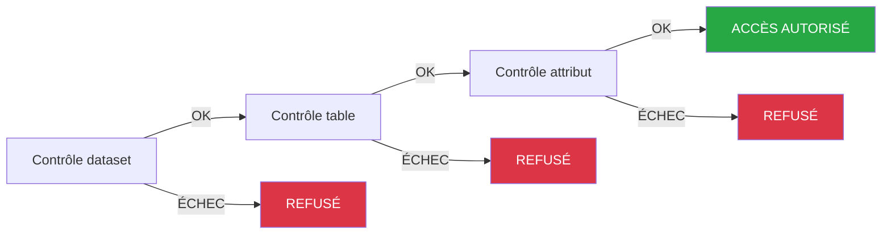

## Objectif

Les policy tags permettent un contrôle d'accès fin aux données en attribuant des étiquettes clé-valeur aux datasets, aux tables et aux attributs. Associés aux [conditions CEL](/guides/public-cloud/data-platform/iam-roles-conditions#nouvelles-conditions-cel) de l'Identity Access Manager, les policy tags déterminent quels utilisateurs peuvent lire ou écrire des données précises.

## Sommaire

1.  [Introduction](#introduction)
2.  [Fonctionnement de l'évaluation des accès](#fonctionnement-de-lévaluation-des-accès)
3.  [Créer un nouveau policy tag](#créer-un-nouveau-policy-tag)
4.  [Configuration d'un policy tag](#configuration-dun-policy-tag)
5.  [Associer des policy tags aux données](#associer-des-policy-tags-aux-données)
6.  [Étapes suivantes](#étapes-suivantes)

## Introduction

Les policy tags vous permettent d'étiqueter des datasets, des tables et des attributs avec des paires clé-valeur représentant des catégories d'accès (par exemple `sensitivity: high`, `department: finance`). Ces étiquettes sont ensuite référencées dans les [conditions CEL](/guides/public-cloud/data-platform/iam-roles-conditions#nouvelles-conditions-cel) associées aux role bindings IAM, afin de contrôler quels utilisateurs peuvent accéder à quelles données.

Un policy tag se compose de deux parties :

-   **Clé** : un identifiant unique (par exemple « sensitivity », « department »).
-   **Valeur** : une clé peut avoir plusieurs valeurs (par exemple « high », « medium », « low »).

:::warning
**Important** : attribuer un policy tag à une ressource ne restreint *pas* automatiquement l'accès. Vous devez également configurer une [condition CEL](/guides/public-cloud/data-platform/lakehouse-manager-policy-tags-cel-conditions) sur le role binding IAM de l'utilisateur, qui référence ce tag. Sans condition CEL, le tag n'a aucun effet sur le contrôle d'accès.
:::

## Fonctionnement de l'évaluation des accès

Lorsqu'un utilisateur tente d'accéder à des données, le système évalue ses permissions via une **chaîne de contrôles séquentiels**. Comprendre cette chaîne est essentiel pour configurer correctement les policy tags et les conditions CEL.

### La chaîne de contrôles

Le système vérifie la [condition CEL](/guides/public-cloud/data-platform/iam-roles-conditions#nouvelles-conditions-cel) de l'utilisateur à trois niveaux de ressource, **dans cet ordre** :

1.  **Dataset** : la condition CEL de l'utilisateur est-elle satisfaite pour ce dataset ?
2.  **Table** : la condition CEL de l'utilisateur est-elle satisfaite pour cette table ?
3.  **Attribut** : la condition CEL de l'utilisateur est-elle satisfaite pour cet attribut ?

Chaque niveau doit être validé avant que le suivant ne soit évalué. Si un niveau échoue, l'accès est **immédiatement refusé** : le système ne passe pas au niveau suivant.

:::warning
**Point clé** : la condition CEL est le **seul mécanisme d'application**. Le système ne vérifie pas les policy tags de manière indépendante : il évalue uniquement la CEL. Si la CEL contient une clause passe-partout pour un niveau de ressource (par exemple `Resource == "attribute"`), les policy tags de ce niveau ne sont **pas appliqués**. Pour exiger un tag à un niveau donné, la CEL doit explicitement le vérifier. Consultez [Rédiger des conditions CEL manuellement](/guides/public-cloud/data-platform/lakehouse-manager-policy-tags-cel-conditions#écrire-des-conditions-cel-manuellement) pour plus de détails.
:::

:::info
Les policy tags appliqués à différents niveaux constituent des **exigences cumulatives**, et non des remplacements. Si un dataset exige le tag A et qu'une table qu'il contient exige le tag B, la CEL de l'utilisateur doit vérifier A au niveau du dataset ET B au niveau de la table. Le tag B ne remplace pas le tag A.
:::

### Héritage

Si aucun policy tag n'est explicitement attribué à une ressource, celle-ci hérite du tag de son parent :

-   **Tables** : si une table n'a pas de policy tag, elle hérite de celui de son dataset parent.
-   **Attributs** : si un attribut n'a pas de policy tag, il hérite de celui de sa table parente (qui peut elle-même en avoir hérité du dataset).
-   **Datasets** : les datasets sont au sommet de la hiérarchie et n'héritent de rien.

L'héritage ne se propage que **vers le bas**. Le tag d'une table n'est jamais propagé vers son dataset parent.

:::info
L'héritage signifie qu'étiqueter un dataset revient à étiqueter tous ses enfants non étiquetés. C'est la manière la plus simple de définir un niveau d'accès de référence.
:::

### Exigences d'accès cumulatives

Chaque niveau de la chaîne de contrôles étant évalué indépendamment, les tags appliqués à différents niveaux se **cumulent**. L'exemple ci-dessous utilise une seule clé de tag, `access_level`, avec les valeurs `level 1`, `level 2` et `level 3` appliquées respectivement aux niveaux dataset, table et attribut.

**Configuration :**

-   **Dataset** : `access_level: level 1`
-   **Table** `chicago_calendar_full` : `access_level: level 2`
-   **Attribut** `bridge` (dans `chicago_calendar_full`) : `access_level: level 3`

Les autres tables du dataset n'ont pas de tag explicite et héritent de `level 1` depuis le dataset.

| Tags de l'utilisateur | Accès au dataset ? | Accès à `chicago_calendar_full` ? | Accès à `bridge` ? |
|---|---|---|---|
| `level 1` uniquement | Oui | Non, `level 2` est également requis | Non |
| `level 1` + `level 2` | Oui | Oui | Non, `level 3` est également requis |
| `level 1` + `level 2` + `level 3` | Oui | Oui | Oui |
| `level 2` uniquement | Non, `level 1` est requis pour le dataset | Non | Non |
| `level 2` + `level 3` | Non, `level 1` est requis pour le dataset | Non | Non |

:::warning
**Avertissement** : les valeurs de tag (`level 1`, `level 2`, `level 3`) n'ont aucune hiérarchie ni ordre intrinsèque dans le produit. Ce sont des étiquettes que vous définissez. `level 2` n'inclut pas automatiquement `level 1`. Chaque valeur requise à un niveau de ressource doit être explicitement accordée à l'utilisateur.
:::

:::info
**Remarque** : un utilisateur qui ne franchit pas le contrôle au niveau du dataset ne peut accéder à *rien* dans ce dataset, quels que soient les tags appliqués aux tables ou aux attributs. Veillez toujours à ce que les utilisateurs disposent du tag de niveau dataset comme base.
:::

-   **User_A (`level 1` uniquement)** : peut accéder aux tables non étiquetées (elles héritent de `level 1`). Ne peut pas accéder à `chicago_calendar_full` : le contrôle au niveau du dataset est validé, mais celui de la table échoue (`level 2` requis). Ne peut pas accéder à `bridge`.
-   **User_B (`level 1` + `level 2`)** : peut accéder aux tables non étiquetées et à `chicago_calendar_full`. La possibilité de lire `bridge` dépend de sa CEL : si celle-ci vérifie les tags au niveau des attributs, l'accès à `bridge` est refusé (`level 3` requis). Si la CEL utilise une clause passe-partout pour les attributs, `bridge` peut rester accessible. Consultez [Modèles de conditions CEL courants](/guides/public-cloud/data-platform/lakehouse-manager-policy-tags-cel-conditions#modèles-cel-courants).
-   **User_C (`level 1` + `level 2` + `level 3`)** : dispose de toutes les valeurs de tag requises dans cette configuration et peut accéder au dataset, à `chicago_calendar_full` et à `bridge` dès lors que la CEL vérifie les policy tags à chaque niveau (les clauses passe-partout pour les attributs sont traitées dans la remarque importante ci-dessous).

:::warning
**Important :** l'application des tags au niveau des attributs dépend entièrement de la condition CEL. Pour restreindre `bridge`, la CEL doit explicitement vérifier `PolicyTags.access_level` pour `Resource == "attribute"`. Une clause passe-partout telle que `|| Resource == "attribute"` **ignore** la vérification du tag et autorise l'accès à tous les attributs.
:::

:::info
Pour vérifier ce scénario en SQL depuis l'Explorer, suivez [Tests et résolution des problèmes](/guides/public-cloud/data-platform/lakehouse-manager-policy-tags-testing).
:::

## Créer un nouveau policy tag

Pour créer un nouveau policy tag, procédez comme suit :

1.  Cliquez sur le bouton **New Policy Tag**.
2.  Saisissez la **Clé** (par exemple « department »), la première **Valeur** (par exemple « finance ») et une **Description** pour le policy tag.
3.  Enregistrez le policy tag et vérifiez-le dans la liste des tags disponibles.

## Configuration d'un policy tag

Après avoir créé le policy tag, vous pouvez le configurer en ajoutant d'autres valeurs (par exemple tech, product) ou en modifiant sa description dans la section `Informations`. Les policy tags doivent être configurés avec soin, en fonction des besoins de sécurité des données.

:::info
Vous pouvez également afficher le menu de configuration du policy tag voulu en cliquant sur le bouton **Éditer**.
:::

La section `Associated Data Resources` détaille les ressources de données – tables, datasets et attributs – auxquelles ce policy tag a été appliqué.

## Associer des policy tags aux données

Les policy tags peuvent être associés à différents composants de données :

### Datasets

1.  Rendez-vous dans la section **Datasets**.
2.  Sélectionnez le dataset auquel appliquer le policy tag.
3.  Associez le policy tag voulu au dataset en le sélectionnant parmi les tags disponibles.

### Tables

1.  Rendez-vous dans la section **Tables**.
2.  Sélectionnez la table à laquelle appliquer le policy tag.
3.  Associez le policy tag à la table en suivant les mêmes étapes que pour les datasets.

### Attributs

1.  Rendez-vous dans la section **Tables** et sélectionnez la table voulue.
2.  Vous pouvez soit cliquer sur la section **POLICY TAGS**, soit cliquer sur l'icône **EDIT** d'un attribut précis.
3.  Repérez l'attribut (la colonne) auquel appliquer le policy tag ; si vous avez choisi un attribut précis en cliquant sur l'icône **EDIT**, vous pouvez ajouter le policy tag directement.
4.  Associez le policy tag voulu à l'attribut. Cette opération peut passer par une liste déroulante ou par une interface d'étiquetage.

## Étapes suivantes

Maintenant que vous savez comment fonctionnent les policy tags et comment les associer à vos données, poursuivez avec :

- [Conditions CEL et modèles d'accès](/guides/public-cloud/data-platform/lakehouse-manager-policy-tags-cel-conditions) : interface Grant Access, rédaction des conditions CEL, cas d'usage courants
- [Tests et résolution des problèmes](/guides/public-cloud/data-platform/lakehouse-manager-policy-tags-testing) : tests de contrôle d'accès pas à pas, erreurs courantes
- [Exemple : accès d'équipe avec des groupes](/guides/public-cloud/data-platform/lakehouse-manager-policy-tags-groups-example) : cas concret d'utilisation des groupes pour l'onboarding

## Aller plus loin

[[fragment:professional-services]]

Posez vos questions, faites-nous part de vos commentaires et interagissez directement avec l’équipe qui développe la Data Platform sur le [canal Discord](https://discord.gg/ovhcloud) dédié.

Si vous avez besoin d'une assistance concernant vos services OVHcloud, créez une demande depuis notre [centre d'aide](/links/support-contact).

Rejoignez notre [communauté d'utilisateurs](/links/community).
