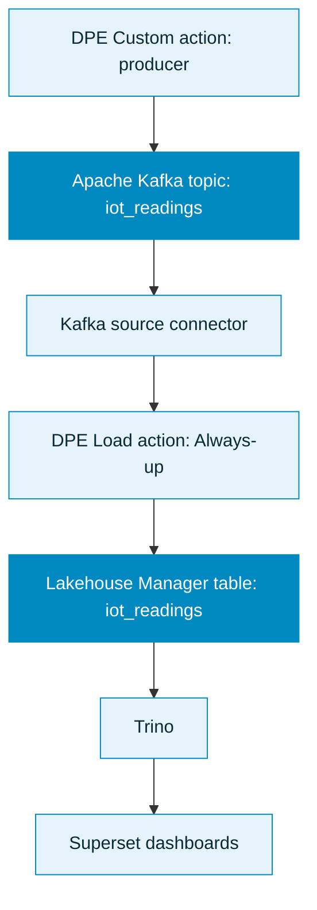
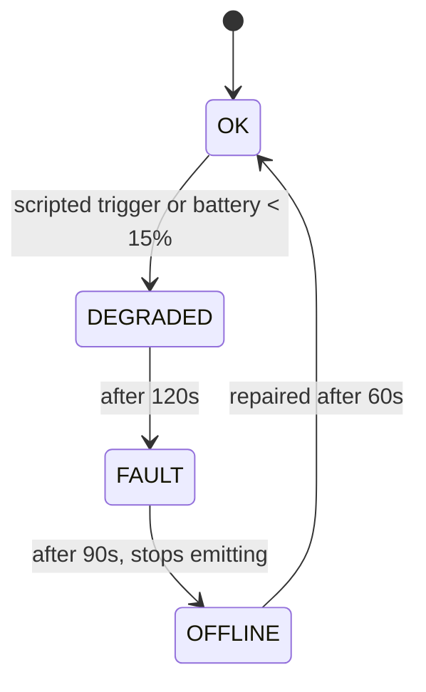

## Objectif

Ce tutoriel vous guide à travers un pipeline complet en temps réel sur la Data Platform : streaming de télémétrie de capteurs IoT simulés depuis une action Custom vers Apache Kafka, ingestion dans une table du Lakehouse Manager, et visualisation de la santé de la flotte sur un dashboard Superset en direct.

À la fin, vous disposerez d'un dashboard fonctionnel qui montre la santé des devices, les tendances environnementales, les anomalies, et les temps d'arrêt, piloté par un scénario de panne scripté afin que les données racontent toujours une histoire.

## Introduction

### Prérequis

Pour suivre ce tutoriel, vous avez besoin de :

- Un projet Data Platform OVHcloud avec le Data Processing Engine, le Lakehouse Manager, et une configuration Superset/Trino disponibles.
- Un broker **Apache Kafka** sur lequel vous pouvez écrire. Ce tutoriel utilise un service Kafka managé OVH avec authentification par certificat client (mTLS), mais l'approche fonctionne avec n'importe quel broker une fois les paramètres de connexion adaptés.
- Un topic Kafka nommé `iot_readings` créé sur votre broker (l'auto-création de topic est souvent désactivée).

Nous recommandons de d'abord terminer le [premier tutoriel de démarrage](/guides/public-cloud/data-platform/landing-page-getting-started) et le tutoriel [Streamer des données depuis Apache Kafka](/guides/public-cloud/data-platform/tutorials-kafka). Ce guide suppose que vous êtes à l'aise avec les principaux composants de la platform.

### Ce que vous allez construire



| Étape | Composant | Rôle |
| ----- | --------- | ---- |
| Produire | [Action Custom](/guides/public-cloud/data-platform/dpe-actions-custom) | Simule des capteurs, émet des relevés JSON plats vers Kafka toutes les 5 secondes |
| Transporter | Apache Kafka | Un seul topic `iot_readings` |
| Ingérer | [Connecteur source Kafka](/guides/public-cloud/data-platform/connectors-sources-kafka) | Diffuse le topic en streaming vers une table |
| Stocker | [Table du Lakehouse Manager](/guides/public-cloud/data-platform/lakehouse-manager-tables) `iot_readings` | Un message devient une ligne |
| Charger | [Action Load](/guides/public-cloud/data-platform/dpe-actions-load) | Consomme le flux vers la table requêtable |
| Visualiser | Superset via [Trino](/guides/public-cloud/data-platform/connectors-consumers-trino) | Dashboards en direct |

### Le scénario

Le producer simule une flotte de capteurs environnementaux (température, humidité, CO₂, PM2.5) répartis sur quatre sites dans trois régions. Une machine à états par device pilote un cycle de panne réaliste afin que les données ne soient jamais plates :



Deux devices sont scriptés pour tomber en panne selon un calendrier fixe, afin que chaque exécution montre de manière fiable l'histoire complète. Les relevés suivent un « cycle quotidien » compressé sur dix minutes avec du bruit aléatoire, de sorte que les tendances paraissent crédibles. Lorsqu'un device passe `OFFLINE`, il cesse complètement d'émettre, ce qui apparaît plus tard comme un véritable trou dans les données.

:::info
**À propos du format des messages.** Le connecteur Kafka ne lit que les champs JSON de premier niveau, et il infère le schéma de la table en échantillonnant les messages. Chaque message émet donc tous les champs avec des types stables (les valeurs numériques sont toujours des floats, `error_code` est la chaîne `"NONE"` quand tout va bien). Un champ parfois absent, ou parfois un entier et parfois un float, casserait le schéma inféré.
:::

## Étape 1 : stocker vos identifiants Kafka dans un bucket

Plutôt que de coller des certificats ou des mots de passe dans la source de l'action, stockez-les dans un [bucket du Lakehouse Manager](/guides/public-cloud/data-platform/lakehouse-manager-buckets) et récupérez-les au runtime. Une action Custom est auto-authentifiée à son projet, elle peut donc lire le bucket sans identifiants supplémentaires, et rien de sensible ne vit dans votre code.

1. Dans le Lakehouse Manager, créez un bucket nommé `iot-demo-certs`.
2. Chargez-y vos trois fichiers mTLS :

| Fichier | Rôle | Paramètre du producer |
| ---- | ---- | ---------------- |
| `certificate.txt` | certificat CA | `ssl_cafile` |
| `user-certificate.txt` | certificat client | `ssl_certfile` |
| `user-access-key.txt` | clé client | `ssl_keyfile` |

Le producer télécharge ces fichiers au démarrage à l'aide du [connecteur bucket](/guides/public-cloud/data-platform/developers-python-sdk-connect-bucket) du SDK.

:::warning
Ne commitez jamais de fichiers de certificat ou de clé dans un repository, et ne les collez jamais dans la source de l'action. Conservez-les uniquement dans le bucket.
:::

## Étape 2 : créer l'action Custom producer

Téléchargez le producer et ajoutez-le comme [action Custom](/guides/public-cloud/data-platform/dpe-actions-custom) :

:::info
<a href="/images/public-cloud/data-platform/getting-further/iot-fleet-monitoring/resources/producer.py" download>producer.py</a>
:::

1. Allez dans **Data Processing Engine > Actions > New > Custom**.
2. Chargez directement le fichier `producer.py` téléchargé.
3. Définissez la fonction d'entrée sur `customfunc` dans le panneau Information de l'action.
4. Ajoutez **`kafka-python`** aux Python Requirements de l'action.
5. Réglez le mode d'exécution sur [Always-up](/guides/public-cloud/data-platform/dpe-jobs-preferences#always-up). Le producer boucle en continu, donc le [mode Serverless](/guides/public-cloud/data-platform/dpe-jobs-preferences#serverless) expirerait par timeout.

:::warning
Utilisez `kafka-python`, pas `kafka`. Le package `kafka` brut sur PyPI est une distribution abandonnée, Python 2 uniquement, et échoue sur les workers avec `invalid syntax (simple.py, line 54)`. C'est le package `kafka-python` qui fournit l'espace de noms `from kafka import ...`.
:::

### Paramètres que vous pouvez ajuster

Toute la configuration se trouve en haut du fichier. Ceux que vous serez le plus susceptible de modifier :

| Paramètre | Valeur par défaut | Ce qu'il contrôle |
| --------- | ------- | ---------------- |
| `BOOTSTRAP` | placeholder | L'endpoint de votre broker Kafka, au format `host:port`. Requis. |
| `KAFKA_MODE` | `"ssl"` | Méthode d'authentification : `"ssl"` pour mTLS, `"sasl_ssl"` pour SASL/SCRAM, ou `"noauth"`. |
| `TOPIC` | `"iot_readings"` | Le topic Kafka vers lequel produire. |
| `MAX_RUNTIME_SECS` | `None` | `None` s'exécute indéfiniment (dashboard en direct). Définissez un nombre de secondes pour une exécution finie qui se termine en SUCCESS plutôt que par un arrêt manuel. |
| `CERT_BUCKET` | `"iot-demo-certs"` | Le bucket Lakehouse contenant vos fichiers de certificat de l'étape 1. |
| `SITES` et `DEVICES_PER_SITE` | 4 sites, 3 chacun | Taille et forme de la flotte simulée. |
| `METRIC_PROFILE` | temperature, humidity, co2, pm25 | Valeur de base, amplitude quotidienne, et bruit pour chaque métrique. |
| Durées `PHASE_*` | 120 / 90 / 60 / 90 s | Durée de chaque phase de panne. |
| `time.sleep(5)` dans la boucle | 5 s | Intervalle d'émission par device. Réduisez-le pour un flux plus rapide. |

### Points clés du code

Vous n'avez pas besoin de lire tout le fichier pour l'exécuter, mais certaines parties méritent d'être connues.

**Bloc de connexion.** Définissez ici l'endpoint de votre broker et la méthode d'authentification, et choisissez si l'exécution est finie :

```python
KAFKA_MODE = "ssl"
TOPIC = "iot_readings"
BOOTSTRAP = "<your-kafka-bootstrap-host>:<port>"
MAX_RUNTIME_SECS = None  # définir des secondes pour une exécution finie en SUCCESS
```

**Identifiants depuis un bucket.** Les certificats sont récupérés au runtime, jamais codés en dur, si bien que rien de sensible ne vit dans l'action :

```python
CERT_SOURCE = "bucket"
CERT_BUCKET = "iot-demo-certs"
# resolve_certs() télécharge le CA, le certificat client, et la clé vers /tmp via le SDK
```

**La flotte.** Modifiez les sites ou le nombre par site pour redimensionner la simulation :

```python
SITES = [
    ("paris-dc1",  "EU-W", "indoor-air"),
    ("london-dc2", "EU-W", "indoor-air"),
    # ...
]
DEVICES_PER_SITE = 3   # 4 sites x 3 -> 12 devices
```

**Le scénario de panne.** Deux devices tombent en panne selon un calendrier fixe, et ces durées fixent le rythme de l'histoire OK vers DEGRADED vers FAULT vers OFFLINE :

```python
PHASE_DEGRADED, PHASE_FAULT, PHASE_OFFLINE, PHASE_REPAIRED_COOLDOWN = 120, 90, 60, 90
```

Lancez l'action. Chaque message porte les douze champs avec des types stables, si bien que le schéma est complet dès que des données commencent à circuler. Le premier device scripté se dégrade après environ quinze secondes, donc les échantillons `DEGRADED` et `FAULT` apparaissent rapidement. Surveillez les logs de l'action pour la ligne de heartbeat : `sent ~N messages; fleet: {...}`.

## Étape 3 : connecter Kafka avec le connecteur source

Allez dans **Connectors > Sources > Apache Kafka** et créez une connexion. Pointez-la vers l'endpoint de votre broker et le topic `iot_readings`.

Pour un broker mTLS, authentifiez-vous avec les **champs SSL** du connecteur : chargez votre certificat CA, votre certificat client, et votre clé client, et laissez le nom d'utilisateur et le mot de passe vides.

:::info
Le formulaire du connecteur expose des champs SSL même lorsque le broker utilise des certificats clients. Ce sont eux qui font fonctionner le handshake mTLS. Pour tous les détails, consultez la [référence du connecteur Kafka](/guides/public-cloud/data-platform/connectors-sources-kafka).
:::

## Étape 4 : extraire les métadonnées et créer la table

Une fois les données en circulation, ouvrez l'[Analyzer](/guides/public-cloud/data-platform/landing-page-connectors-analyzer) et [extrayez les métadonnées](/guides/public-cloud/data-platform/connectors-analyzer-extract-metadata).

Vous verrez seize attributs : les douze champs du producer, plus quatre colonnes d'enveloppe ajoutées par Kafka (`timestamp`, `date`, `offset_r`, `partition`). Pour une simple table en ajout seul, vous pouvez ignorer les quatre colonnes d'enveloppe. Ne conservez `partition` et `offset_r` que si vous voulez une sémantique d'upsert ou de déduplication.

Le producer émet `ts` sous forme de chaîne ISO-8601. S'il est inféré comme une chaîne, vous pouvez soit le définir comme type Timestamp dans la table, soit le conserver comme chaîne et le parser dans Trino (voir [Bon à savoir](#bon-à-savoir)). Construisez la [table du Lakehouse Manager](/guides/public-cloud/data-platform/lakehouse-manager-tables) `iot_readings` à partir du schéma obtenu.

La liste complète des colonnes :

| Attribut | Type | Notes |
| --------- | ---- | ----- |
| `ts` | Timestamp | heure UTC de l'événement, ISO-8601 |
| `device_id` | String | par exemple `paris-dc1-sensor-01` |
| `site` | String | dimension dénormalisée |
| `region` | String | `EU-W`, `EU-C`, `EU-E` |
| `device_type` | String | `indoor-air` ou `outdoor-air` |
| `temperature` | Number | °C |
| `humidity` | Number | % |
| `co2` | Number | ppm |
| `pm25` | Number | µg/m³ |
| `battery_pct` | Number | décline au fil de la vie du device, pilote la panne |
| `status` | String | `OK`, `DEGRADED`, `FAULT` (jamais `OFFLINE`, voir ci-dessous) |
| `error_code` | String | `NONE`, `E_DRIFT`, `E_BATTERY`, `E_STUCK`, `E_SPIKE` |

:::info
`OFFLINE` n'apparaît jamais comme valeur de ligne. Un device hors ligne cesse d'émettre, donc le temps d'arrêt apparaît comme un trou (aucune ligne pour ce `device_id`). Vous le détectez en comparant le `ts` le plus récent de chaque device à l'heure actuelle.
:::

## Étape 5 : charger le flux dans votre table

Créez une [action Load](/guides/public-cloud/data-platform/dpe-actions-load) dans le Data Processing Engine, en associant le topic `iot_readings` à votre table `iot_readings`. Exécutez-la en [mode Always-up](/guides/public-cloud/data-platform/dpe-jobs-preferences#always-up) afin qu'elle continue à consommer le flux en direct.

:::warning
L'action Load continue de s'exécuter tant que des données existent dans Kafka, jusqu'à son timeout. C'est le comportement attendu pour un chargement en streaming.
:::

Une action Load qui se termine normalement lance automatiquement une mise à jour des métadonnées, de sorte que le nombre de lignes de la table se rafraîchit tout seul. Dans cette configuration en streaming, l'action s'exécute en Always-up et est arrêtée manuellement ou expire par timeout plutôt que de se terminer proprement, si bien que cette mise à jour automatique peut ne pas s'exécuter. Dans ce cas, lancez une [action Update Metadata](/guides/public-cloud/data-platform/dpe-actions-maintenance#update-metadata) afin que le nombre de lignes dans le Lakehouse Manager reflète les données ingérées.

## Étape 6 : requêter la table depuis Superset

Connectez Superset à votre table via [Trino](/guides/public-cloud/data-platform/connectors-consumers-trino). Si vous n'avez pas encore déployé Superset, suivez [Déployer Apache Superset](/guides/public-cloud/data-platform/tutorials-install-apache-superset).

Dans Superset, ajoutez une connexion à une base de données avec une URI SQLAlchemy de la forme `trino://<user>@<trino-host>:<port>/<catalog>`. Testez la connexion avant de construire des graphiques. C'est l'étape où les configurations de bout en bout échouent le plus souvent.

Si `ts` est arrivé sous forme de chaîne, parsez-le dans Trino avec `from_iso8601_timestamp(ts)`, qui retourne un `TIMESTAMP(3) WITH TIME ZONE`. Créez un dataset virtuel qui expose la colonne parsée et marquez-la comme la colonne temporelle principale du dataset, afin qu'elle devienne disponible comme axe X des graphiques de séries temporelles.

## Étape 7 : construire les dashboards

Le dashboard fini offre une vue en un seul écran de toute la flotte.


Un ensemble pratique de panneaux :

| Panneau | Type de graphique | Ce qu'il montre |
| ----- | ---------- | ------------- |
| Ligne de KPI | Big Number | Devices en ligne, taille de la flotte, devices en alerte, CO₂ moyen actuel |
| Santé de la flotte | Donut | Répartition en direct des statuts sur la flotte |
| Niveaux de batterie | Bar | Batterie par device, la plus faible en premier, pour la maintenance prédictive |
| Tendance des relevés | Line (série temporelle) | CO₂, température, PM2.5 dans le temps, par site |
| Relevés par site | Bar | CO₂ et PM2.5 moyens comparés entre sites |
| Répartition des codes d'erreur | Bar | Quels types de pannes surviennent |
| Tableau des temps d'arrêt | Table | Devices dont le dernier relevé est obsolète, mis en évidence |

Pour les datasets virtuels complets et le SQL Trino exact et la configuration de chaque panneau, suivez la page complémentaire :

[Construire les dashboards Superset](/guides/public-cloud/data-platform/tutorials-iot-fleet-monitoring-superset-dashboards)

Quelques astuces Superset qui font gagner du temps :

- Sur les **bar charts**, placez la catégorie dans l'axe X et laissez la case Dimensions vide. Dimensions ne sert qu'à découper chaque barre en sous-séries.
- Les lignes de seuil, comme un niveau d'alerte batterie, sont disponibles sur les graphiques de séries temporelles via des couches d'annotation. Sur un bar chart catégoriel, triez par ordre croissant à la place. Sur un table, utilisez le conditional formatting.
- Les valeurs de CO₂ (autour de 480) écrasent la temperature (autour de 21) et le PM2.5 (autour de 9) sur un axe partagé. Affichez le CO₂ séparément, ou utilisez un axe secondaire, afin que les petites métriques restent lisibles.
- Le tableau des temps d'arrêt est vide lorsque la flotte est en bonne santé, ce qui est normal. Construisez-le sans filtre afin qu'il liste chaque device, puis mettez en évidence les lignes obsolètes avec le conditional formatting, afin que le panneau ne paraisse jamais cassé.

## Bon à savoir

- **Le producer ne se termine jamais par conception.** C'est une boucle infinie en mode Always-up. Le timeout par défaut de l'action est d'environ deux heures. Si vous l'arrêtez manuellement, il apparaît comme « stopped » plutôt que comme un succès, car il n'y a pas de fin naturelle. Pour obtenir une exécution propre en succès, définissez `MAX_RUNTIME_SECS` sur un nombre de secondes. La boucle vide alors ses buffers, se ferme, enregistre un total, et se termine. Laissez-le à `None` pour un dashboard en direct en continu.
- **Rafraîchissez le nombre de lignes avec Update Metadata.** Une action Load qui se termine normalement met à jour automatiquement les métadonnées de la table. Dans cette configuration en streaming, l'action s'exécute en Always-up et est arrêtée ou expire par timeout au lieu de se terminer proprement, si bien que, comme indiqué à l'étape 5, vous devrez peut-être lancer une action Update Metadata pour que le nombre de lignes reflète ce qui a été ingéré.
- **Parsez `ts` pour les séries temporelles.** Si la colonne est une chaîne, parsez-la avec `from_iso8601_timestamp(ts)` et marquez-la comme colonne temporelle dans Superset.
- **Prémunissez-vous contre les lignes non parsables.** Si un message de test a laissé une ligne dont `ts` n'est pas un timestamp valide, `from_iso8601_timestamp` lève `INVALID_FUNCTION_ARGUMENT`. Enveloppez le parsing dans `try(from_iso8601_timestamp(ts))` afin que la ligne invalide prenne la valeur null, ou supprimez la ligne.

## Ce que vous avez construit

Vous disposez maintenant d'un pipeline de streaming complet : une action Custom produisant de la télémétrie simulée, Kafka la transportant, un connecteur et une action Load l'ingérant dans le Lakehouse Manager, et Superset la visualisant en direct via Trino. Au fur et à mesure que les pannes scriptées se déroulent, le dashboard traverse toute l'histoire : une flotte en bonne santé, un device qui se dégrade puis tombe en panne, une fenêtre de temps d'arrêt qui apparaît dans le tableau des temps d'arrêt et comme un trou dans la tendance, et enfin une réparation qui ramène le device à la normale.

À partir de là, vous pouvez étendre le modèle avec une table de dimension device séparée, ajouter davantage de métriques, ou adapter le producer pour rejouer vos propres données de capteurs réelles.

:::info
**Ce modèle passe à l'échelle.** Les mêmes briques de base se composent en un pipeline beaucoup plus vaste. Comme un topic correspond à une table, vous gérez plusieurs flux de données en répétant les éléments : ajoutez davantage de topics Kafka, extrayez les métadonnées de chacun vers sa propre table du Lakehouse Manager, et exécutez une action Load par mapping topic-vers-table. Un seul producer peut émettre vers plusieurs topics, et Superset peut joindre les tables résultantes via Trino. Ainsi, une flotte multi-topics et multi-tables (par exemple, des flux séparés pour les relevés environnementaux, la consommation d'énergie, et les événements de device) n'est jamais que ce tutoriel appliqué plusieurs fois, alimentant un même ensemble de dashboards.
:::

## Aller plus loin

Pour une formation ou une assistance technique sur la mise en œuvre de nos solutions, contactez votre commercial ou consultez la page [Professional Services](/links/professional-services) pour obtenir un devis et faire analyser votre projet par nos experts.

Posez vos questions, faites-nous part de vos commentaires et interagissez directement avec l’équipe qui développe la Data Platform sur le [canal Discord](https://discord.gg/ovhcloud) dédié.

Si vous avez besoin d'une assistance concernant vos services OVHcloud, créez une demande depuis notre [centre d'aide](/links/support-contact).

Rejoignez notre [communauté d'utilisateurs](/links/community).
